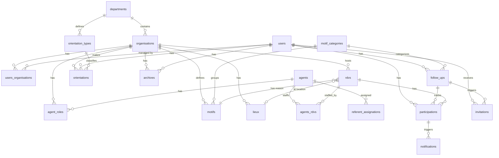
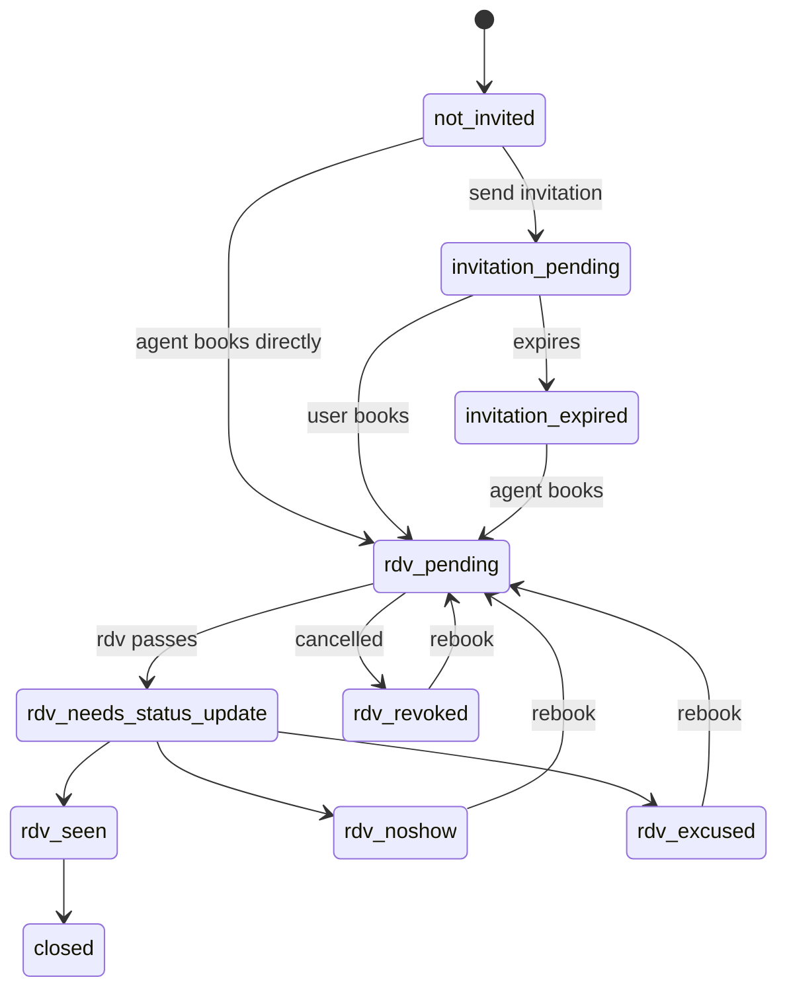

# RDVI Metabase Instance

**URL:** https://rdv-service-public-metabase.osc-secnum-fr1.scalingo.io
**Instance name:** `rdvi`
**API key env var:** `METABASE_RDVI_API_KEY`
**HTTP Basic auth env var:** `METABASE_RDVI_BASIC_AUTH` (`username:password`)
**API user:** `matometa` (id=35, non-admin)

Related: [RDV-Insertion Matomo site](../sites/rdv-insertion.md) (site ID 214, tracks agent web UI).

## Databases

| ID | Name | Engine | Tables | Notes |
|----|------|--------|--------|-------|
| 2 | Prod ETL | PostgreSQL | 152 | Main production database |
| 5 | Staging ETL | PostgreSQL | 70 | Staging mirror (rdvs + rdvsp schemas only), ignore |

Default database_id for queries: **2** (Prod ETL).

## Schemas

| Schema | Application | Description |
|--------|------------|-------------|
| `rdvi` | **RDV-Insertion** | Invitation/follow-up layer for social services — the main product |
| `rdvs` | **RDV-Solidarités** | Appointment booking for social services (underlying platform) |
| `rdvsp` | **RDV-Service-Public** | Appointment booking for public services (CDAD, civil services, etc.) |
| `csv_uploads` | (uploads) | Ad-hoc CSV files uploaded by team members |

Many tables exist in all three schemas with similar structures but columns varying by app.

---

## Départements & Conseils Départementaux

### The `rdvi.departments` table

79 departments total, each with an internal `id` (distinct from the INSEE code).

Key columns:
- `id` — Internal identifier, **used in Matomo URLs** as `/departments/{id}/users`
- `number` — INSEE code (e.g., "44" for Loire-Atlantique)
- `name` — Department name
- `region` — Region name
- `parcours_enabled` — Whether the full parcours feature is active (most are `true`)
- `display_in_stats` — Whether this department shows in official public stats

The internal ID ↔ INSEE code mapping is documented in [rdv-insertion.md](../sites/rdv-insertion.md#identifiants-départements-api). The Allier has two entries (IDs 38/73) for different programs (TZI and RSA).

### Organisations per department

Organisations are the operational units within each department. Types:

| Type | Total | Active | Description |
|------|-------|--------|-------------|
| `conseil_departemental` | 348 | 334 | Territorial social service offices (CDS, DTAS, etc.) |
| `delegataire_rsa` | 179 | 160 | RSA-delegated bodies (associations, missions locales) |
| `siae` | 126 | 108 | Structures d'Insertion par l'Activité Économique |
| `france_travail` | 69 | 69 | France Travail (ex-Pôle Emploi) agencies |
| `autre` | 10 | 10 | Other (Cap Emploi, missions locales, CAPS, etc.) |

A single department can have many organisations. Loire-Atlantique (44) has 83 (72 CD + 9 delegataires + 2 SIAE). Most departments have 1-15 organisations.

### Pre-computed stats per department

`rdvi.stats` has one row per department (`statable_type = 'Department'`, 82 rows) and one per organisation (`statable_type = 'Organisation'`, 781 rows).

Top departments by agent count (2025):

| Dept | Name | Agents | No-show % | Autonomous % | Oriented % | Inv→RDV days |
|------|------|--------|-----------|-------------|------------|-------------|
| 44 | Loire-Atlantique | 317 | 16.1% | 57.3% | 58.3% | 14.0 |
| 78 | Yvelines | 140 | 14.6% | 52.4% | 71.8% | 3.5 |
| 93 | Seine-Saint-Denis | 138 | 18.0% | 49.2% | 46.1% | 24.7 |
| 74 | Haute-Savoie | 127 | 8.5% | 58.6% | 33.1% | 12.8 |
| 84 | Vaucluse | 103 | 7.8% | 67.7% | 78.1% | 3.1 |
| 64 | Pyrénées-Atlantiques | 87 | 15.0% | 56.8% | 72.5% | 9.9 |
| 13 | Bouches-du-Rhône | 86 | 9.7% | 66.9% | 54.5% | 14.1 |
| 83 | Var | 84 | 14.7% | 63.4% | 76.1% | 5.4 |

---

## The Main Funnel

RDV-Insertion's core business process, from intake to outcome:

```
User created in system
  → Orientation assigned (rdvi.orientations — pro/socio_pro/social)
  → Follow-up created (rdvi.follow_ups — tracks the user's state machine)
  → Invitation sent (rdvi.invitations — sms/email/postal)
      → Delivery tracked (delivery_status: delivered/soft_bounce/hard_bounce/blocked)
      → Click tracked (invitations.clicked boolean)
  → Notification sent (rdvi.notifications — participation_created/reminder/updated/cancelled)
  → RDV created (rdvi.rdvs — by agent/user/prescripteur)
      → Participation recorded (rdvi.participations — seen/excused/noshow/unknown/revoked)
  → Archive (rdvi.archives — when user exits the parcours)
```

### Invitations (2025 totals)

| Format | Sent | Clicked | Click rate |
|--------|------|---------|-----------|
| SMS | 212,622 | 106,171 | 49.9% |
| Email | 206,544 | 63,111 | 30.6% |
| Postal | 11,286 | 491 | 4.4% |

Triggers: 72% manual (agent-initiated), 25% reminder (automatic), 2% periodic.

Delivery: 89% delivered, 6% soft_bounce, 4% unknown, <1% blocked/hard_bounce.

### RDVs (2025 totals)

Created by: **agents** 78% (250K), **users** 22% (71K), **prescripteurs** <1% (786).

Location type: **in-person** 88% (284K), **phone** 12% (39K), **home** <1%.

Statuses: seen 61%, excused 11%, unknown 11%, noshow 10%, revoked 7%.

### Participations (2025 totals)

| Status | Total | Convocable | Non-convocable |
|--------|-------|------------|----------------|
| seen | 229,666 | 49,759 | 179,907 |
| excused | 48,147 | 14,831 | 33,316 |
| unknown | 46,773 | 13,014 | 33,759 |
| noshow | 44,243 | 16,734 | 27,509 |
| revoked | 25,539 | 6,857 | 18,682 |

Convocable participations have a higher no-show rate (16.6%) vs non-convocable (9.4%).

### Follow-up statuses

The `follow_ups` table tracks each user's state machine through the funnel:

| Status | 2025 count | Meaning |
|--------|-----------|---------|
| rdv_seen | 90,331 | User attended their RDV |
| not_invited | 34,554 | User exists but hasn't been invited yet |
| closed | 33,396 | Parcours closed |
| rdv_pending | 16,549 | RDV scheduled, waiting |
| invitation_expired | 16,319 | Invitation sent but expired without action |
| rdv_noshow | 12,639 | User didn't show up |
| rdv_needs_status_update | 11,374 | RDV happened but status not yet recorded |
| rdv_excused | 9,947 | User excused from RDV |
| rdv_revoked | 5,737 | RDV was cancelled |
| invitation_pending | 3,917 | Invitation sent, waiting for response |

### Invitation outcome by follow-up status

Shows what happened to users who received invitations:

| Follow-up outcome | Invitations | Clicked | Click rate |
|-------------------|-------------|---------|-----------|
| rdv_seen | 151,559 | 75,339 | 49.7% |
| closed | 75,912 | 28,824 | 38.0% |
| invitation_expired | 74,943 | 18,138 | 24.2% |
| rdv_noshow | 22,459 | 7,679 | 34.2% |
| invitation_pending | 21,872 | 5,451 | 24.9% |
| rdv_excused | 16,576 | 7,849 | 47.3% |

### Monthly funnel (2025)

| Month | Invitations | Clicked | Participations | Not revoked | Seen | Noshow |
|-------|-------------|---------|----------------|-------------|------|--------|
| 2025-01 | 32,646 | 13,590 | 22,184 | 20,329 | 16,972 | 2,929 |
| 2025-02 | 27,304 | 11,937 | 20,299 | 18,717 | 15,709 | 2,825 |
| 2025-03 | 32,119 | 13,143 | 22,761 | 21,241 | 17,891 | 3,347 |
| 2025-04 | 30,121 | 12,304 | 22,927 | 21,247 | 17,456 | 3,542 |
| 2025-05 | 30,948 | 11,864 | 21,556 | 19,835 | 16,348 | 3,123 |
| 2025-06 | 31,626 | 12,529 | 23,745 | 21,925 | 17,828 | 3,597 |
| 2025-07 | 32,240 | 12,124 | 24,617 | 22,939 | 17,674 | 3,824 |
| 2025-08 | 29,228 | 10,705 | 19,811 | 18,404 | 14,225 | 3,214 |
| 2025-09 | 32,286 | 13,041 | 27,808 | 25,599 | 21,235 | 4,155 |
| 2025-10 | 37,020 | 14,900 | 30,253 | 28,103 | 23,338 | 4,272 |
| 2025-11 | 38,834 | 14,675 | 28,066 | 25,998 | 20,835 | 3,935 |
| 2025-12 | 32,935 | 12,454 | 24,645 | 22,373 | 16,972 | 3,311 |

Growth trend: Sep-Nov 2025 shows a ramp-up (likely new department onboardings).

### Notifications (rdvi-specific)

Notifications are sent to users about their participations (distinct from invitations):

| Event | SMS delivered | Email delivered | Postal | SMS bounce |
|-------|-------------|----------------|--------|-----------|
| participation_created | 78,972 | 85,058 | 15,596 | 8,732 |
| participation_reminder | 64,056 | 69,833 | — | 7,623 |
| participation_cancelled | 5,380 | 5,811 | 76 | 593 |
| participation_updated | 4,778 | 5,024 | — | 496 |

### Orientations

Orientation types follow the CASF classification:

| CASF category | Example types | 2025 orientations |
|---------------|--------------|-------------------|
| `pro` | Professionnelle, Emploi | ~4,047 |
| `socio_pro` | Socio-professionnelle, Équilibré | ~2,031 |
| `social` | Sociale, Remobilisation | ~1,036 |

Mostly used in Territoire de Belfort (90), Allier (03), and Rhône (69).

### Motif categories

85 motif categories, dominated by RSA-related ones:

| Top categories | Type | Active motifs |
|----------------|------|---------------|
| RSA orientation | rsa_orientation | 501 |
| RSA accompagnement | rsa_accompagnement | 369 |
| RSA suivi | rsa_accompagnement | 306 |
| RSA Premier RDV d'accompagnement | rsa_accompagnement | 182 |
| RSA Atelier collectif obligatoire | rsa_accompagnement | 156 |
| RSA signature CE | rsa_accompagnement | 144 |
| Entretien SIAE | siae | 126 |

---

## Metabase ↔ Matomo: What Lives Where

Metabase (this instance) tracks **business data** — what actually happened in the system.
Matomo ([rdv-insertion.md](../sites/rdv-insertion.md)) tracks **agent web UI interactions** — what agents did in the browser.

### What to query where

| Question | Source | How |
|----------|--------|-----|
| How many invitations were sent? | **Metabase** `rdvi.invitations` | COUNT with date filter |
| How many users clicked an invitation link? | **Metabase** `rdvi.invitations WHERE clicked = true` | The click is server-side tracked |
| How many RDVs happened? | **Metabase** `rdvi.rdvs` / `rdvi.participations` | Filter by status |
| What's the no-show rate for a department? | **Metabase** `rdvi.stats` | Pre-computed `rate_of_no_show` |
| How many agents are active on the web UI? | **Matomo** | Unique visitors (each visitor = one agent) |
| What features do agents use most? | **Matomo** | Event tracking (`rdvi_*` events) |
| How many file uploads were started? | **Matomo** | `Chargement du fichier` event (46K/month) |
| How many file uploads completed in the DB? | **Metabase** `rdvi.user_list_uploads` | COUNT with date filter |
| Which filters do agents use? | **Matomo** | `rdvi_index-nav_filter-*` events |
| How many users were archived? | **Metabase** `rdvi.archives` | COUNT with date filter |
| Did agents click "archive"? | **Matomo** | `archive-button` event (2.4K/month) |
| SMS delivery stats? | **Metabase** `rdvi.invitations` + `rdvi.notifications` | delivery_status column |
| Agent session duration? | **Matomo** | Avg time on site (~15min) |

### Linking department IDs across systems

Matomo URLs contain the **internal department ID** (e.g., `/departments/28/users` = Loire-Atlantique).
Metabase `rdvi.departments` table contains both the internal `id` and the INSEE `number`.

To cross-reference: use the mapping table in [rdv-insertion.md](../sites/rdv-insertion.md#identifiants-départements-api).

### The upload workflow across both systems

The upload (bulk user import) is the highest-volume interaction and spans both:

1. **Matomo tracks the agent's UI steps**: category selection (`rdvi_upload_select-category_*`), file selection (`rdvi_upload_select-file_*`), user data review (`rdvi_upload_users-data_*`), invitation sending (`rdvi_upload_users-invit_*`)
2. **Metabase tracks the results**: `rdvi.user_list_uploads` (upload records), `rdvi.user_list_upload_user_rows` (parsed rows), `rdvi.user_list_upload_user_save_attempts` (save results), `rdvi.user_list_upload_invitation_attempts` (invitation results)

---

## Data Model

### Entity Relationships



### Key Entities

| Table | Key Columns | Notes |
|-------|-------------|-------|
| **departments** | `id` (internal), `number` (INSEE code), `name`, `parcours_enabled` | `id` ≠ INSEE code |
| **organisations** | `department_id`, `name`, `organisation_type`, `archived_at` | Types: `conseil_departemental`, `delegataire_rsa`, `france_travail`, `siae`, `autre` |
| **agents** | `email` (real), `last_sign_in_at`, `super_admin` | Work FOR organisations via `agent_roles` |
| **agent_roles** | `agent_id`, `organisation_id`, `access_level` | `basic` or `admin` |
| **users** | `affiliation_number` (CAF), `role`, `nir` (encrypted), `france_travail_id`, `created_through`, `deleted_at` | Managed BY organisations via `users_organisations` |
| **users_organisations** | `user_id`, `organisation_id`, `created_at` | User can belong to multiple orgs |
| **archives** | `user_id`, `organisation_id`, `archiving_reason` | Per-org exit record |

### The Funnel

| Table | Key Columns | Notes |
|-------|-------------|-------|
| **motif_categories** | `short_name`, `motif_category_type` | Types: `rsa_orientation`, `rsa_accompagnement`, `siae`, `autre` |
| **motifs** | `organisation_id`, `motif_category_id`, `name`, `collectif`, `location_type` | Org-specific appointment reasons |
| **follow_ups** | `user_id`, `motif_category_id`, `status`, `closed_at` | State machine per user per category |
| **invitations** | `user_id`, `follow_up_id`, `format`, `trigger`, `clicked`, `delivery_status`, `expires_at` | "Please book" messages |
| **lieux** | `organisation_id`, `name`, `address` | Physical locations |
| **rdvs** | `organisation_id`, `motif_id`, `lieu_id`, `starts_at`, `created_by`, `users_count` | Appointment slots |
| **participations** | `user_id`, `rdv_id`, `follow_up_id`, `status`, `convocable` | **This is what official stats count as "rdvs"** |
| **notifications** | `participation_id`, `event`, `format`, `delivery_status` | "Your RDV is confirmed" messages |
| **orientations** | `user_id`, `organisation_id`, `orientation_type_id`, `starts_at`, `ends_at` | Official track assignment |

### Follow-Up State Machine



### Invitation vs Notification

| Invitation | Notification |
|------------|--------------|
| "Please book an appointment" | "Your appointment is confirmed" |
| Sent before RDV exists | Sent after RDV is created |
| Has `clicked` tracking | Has `delivery_status` only |
| Linked to `follow_up` | Linked to `participation` |

### Counting: Participations ≠ RDVs

**Official stats page counts participations, not rdvs:**

| Metric | Actually counts |
|--------|-----------------|
| "rendez-vous pris" | `COUNT(participations)` |
| "usagers gérés" | `COUNT(users)` by month |

1 RDV can have N participations (group appointments). To match official stats:

```sql
SELECT COUNT(*) FROM rdvi.participations;  -- Matches "rendez-vous pris"
SELECT COUNT(*) FROM rdvi.rdvs;            -- Lower (~2.5x less)
```

### Query Patterns

**User's organisations:**
```sql
SELECT u.id, o.name, o.organisation_type, d.number
FROM rdvi.users u
JOIN rdvi.users_organisations uo ON uo.user_id = u.id
JOIN rdvi.organisations o ON o.id = uo.organisation_id
JOIN rdvi.departments d ON d.id = o.department_id
WHERE u.id = ?;
```

**User's appointment history:**
```sql
SELECT r.starts_at, m.name as motif, p.status, o.name as org
FROM rdvi.participations p
JOIN rdvi.rdvs r ON r.id = p.rdv_id
JOIN rdvi.motifs m ON m.id = r.motif_id
JOIN rdvi.organisations o ON o.id = r.organisation_id
WHERE p.user_id = ?
ORDER BY r.starts_at;
```

**Organisation's monthly activity:**
```sql
SELECT DATE_TRUNC('month', p.created_at) as month,
       COUNT(*) as participations,
       COUNT(*) FILTER (WHERE p.status = 'seen') as seen,
       COUNT(*) FILTER (WHERE p.status = 'noshow') as noshow
FROM rdvi.participations p
JOIN rdvi.rdvs r ON r.id = p.rdv_id
WHERE r.organisation_id = ?
GROUP BY 1 ORDER BY 1;
```

---

## Table Reference

### Core Tables (rdvi schema)

| Table | Key columns | Description |
|-------|------------|-------------|
| `departments` | id, number, name, region, parcours_enabled, display_in_stats | Départements |
| `organisations` | id, name, department_id, organisation_type, slug, archived_at | Operational units within departments |
| `agents` | id, email, first_name, last_name, last_sign_in_at | Staff/professionals |
| `agent_roles` | agent_id, organisation_id, access_level | Agent permissions per org |
| `users` | id, first_name, last_name, role, department_internal_id, created_through | Beneficiaries |
| `users_organisations` | user_id, organisation_id | User-to-org links |
| `referent_assignations` | user_id, agent_id | Agent referent assignments |
| `rdvs` | id, starts_at, status, organisation_id, motif_id, lieu_id, created_by, users_count | Appointments |
| `participations` | id, user_id, rdv_id, status, convocable, follow_up_id, created_by_type | User attendance records |
| `invitations` | id, format, delivery_status, clicked, trigger, follow_up_id, department_id | Invitations to users |
| `notifications` | id, event, format, delivery_status, participation_id | Delivery notifications |
| `follow_ups` | id, user_id, status | User state machine |
| `orientations` | id, user_id, organisation_id, orientation_type_id, starts_at | Orientation assignments |
| `orientation_types` | id, casf_category, name, department_id | Orientation classifications |
| `motifs` | id, name, motif_category_id, location_type, collectif, deleted_at | Appointment reasons |
| `motif_categories` | id, short_name, name, motif_category_type | Motif groupings |
| `lieux` | id, name, address, organisation_id | Physical locations |
| `archives` | id, user_id, archiving_reason, department_id | User exit records |
| `stats` | statable_type, statable_id, rate_of_no_show, rate_of_autonomous_users, ... | Pre-computed KPIs |
| `category_configurations` | id, motif_category_id, organisation_id, convene_user, invitation_formats | Per-org motif settings |
| `tags` / `tag_users` / `tag_organisations` | id, value / tag_id, user_id / tag_id, organisation_id | Tagging system |
| `templates` | id, model, rdv_title, rdv_purpose | RDV templates |

### Tables in rdvs/rdvsp schemas (parallel to rdvi)

These schemas contain the underlying RDV-Solidarités and RDV-Service-Public data. Same table names but different columns. Key ones: `rdvs`, `participations`, `agents`, `users`, `organisations`, `territories`, `motifs`, `lieux`, `receipts` (SMS/email delivery), `plage_ouvertures` (availability slots), `absences`.

## Data Anonymization

The ETL anonymizes beneficiary PII systematically. Agent data is intentionally left in cleartext (professional context).

**Beneficiaries (users):** All personal data anonymized across all three schemas — names become `[valeur unique anonymisée X]`, emails become `email_anonymise_X@exemple.fr`, phone numbers, addresses, NIR, and birth dates are all masked. This applies to `rdvi.users`, `rdvs.users`, and `rdvsp.users`.

**Agents:** Real professional email addresses in `rdvi.agents.email` (e.g., `prenom.nom@departement.fr`). Names are anonymized. `rdvs.agents` and `rdvsp.agents` have emails anonymized too — only the rdvi schema keeps them.

**Other tables:** Lieux addresses, invitation links, receipt content, prescripteur data, super_admin data — all anonymized. Organisation and department names are real (public institutional data).

**Infrastructure note:** `rdvs.webhook_endpoints.target_url` contains real webhook URLs (not anonymized), though the `secret` column is masked.

## Query Examples

```python
from lib._sources import get_metabase
api = get_metabase("rdvi")

# Department KPIs
result = api.execute_sql("""
    SELECT d.number, d.name, s.agents_count,
           s.rate_of_no_show, s.rate_of_autonomous_users
    FROM rdvi.stats s
    JOIN rdvi.departments d ON s.statable_id = d.id
    WHERE s.statable_type = 'Department'
    ORDER BY s.agents_count DESC
""")

# Monthly funnel
result = api.execute_sql("""
    SELECT DATE_TRUNC('month', created_at) as month,
           COUNT(*) as sent,
           COUNT(*) FILTER (WHERE clicked) as clicked
    FROM rdvi.invitations
    WHERE created_at >= '2025-01-01'
    GROUP BY 1 ORDER BY 1
""")

# Organisation-level activity
result = api.execute_sql("""
    SELECT o.name, o.organisation_type, d.number,
           COUNT(r.id) as rdvs_2025
    FROM rdvi.organisations o
    JOIN rdvi.departments d ON o.department_id = d.id
    LEFT JOIN rdvi.rdvs r ON r.organisation_id = o.id
        AND r.created_at >= '2025-01-01'
    WHERE o.archived_at IS NULL
    GROUP BY o.name, o.organisation_type, d.number
    ORDER BY rdvs_2025 DESC
    LIMIT 20
""")
```
