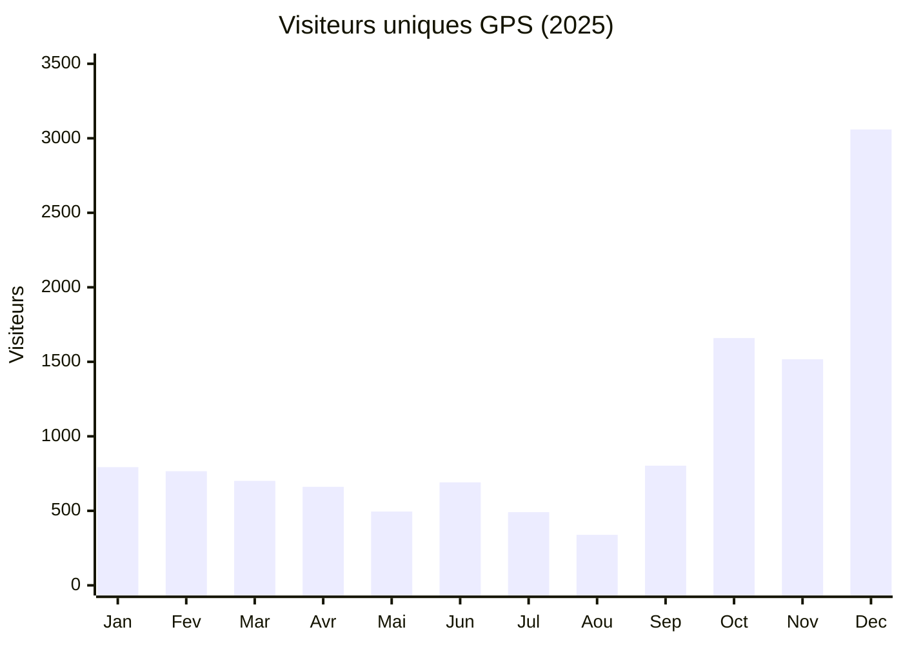
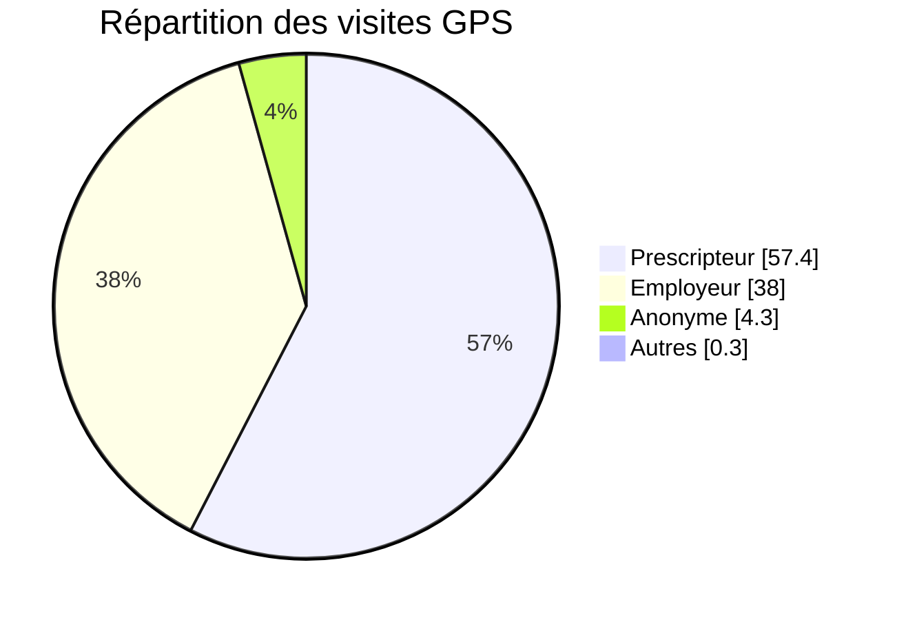
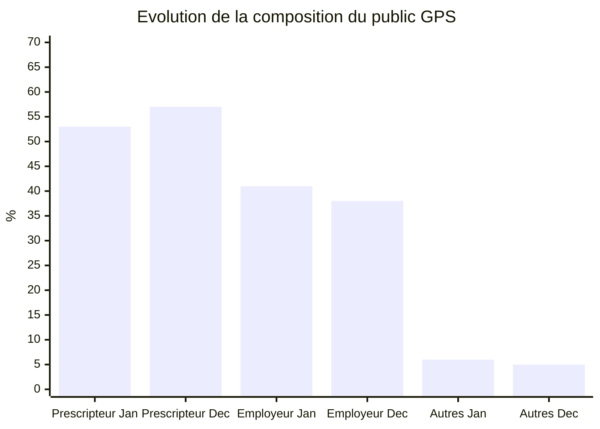
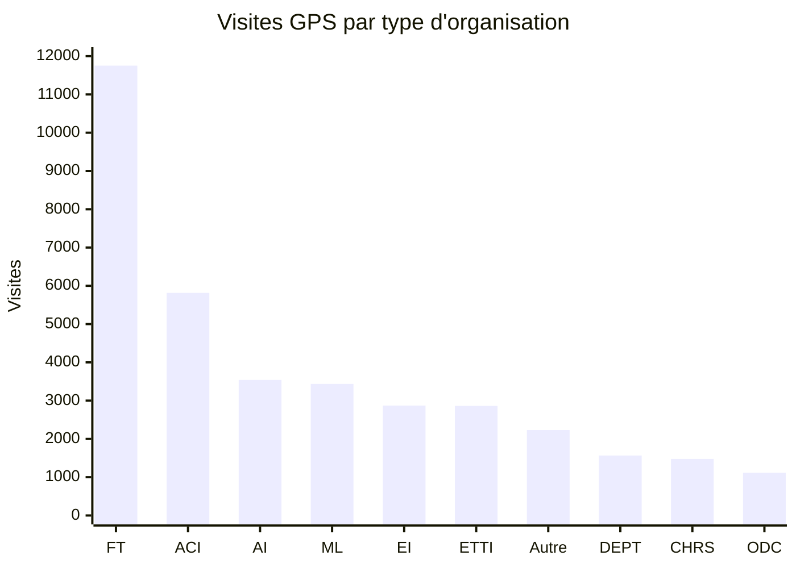
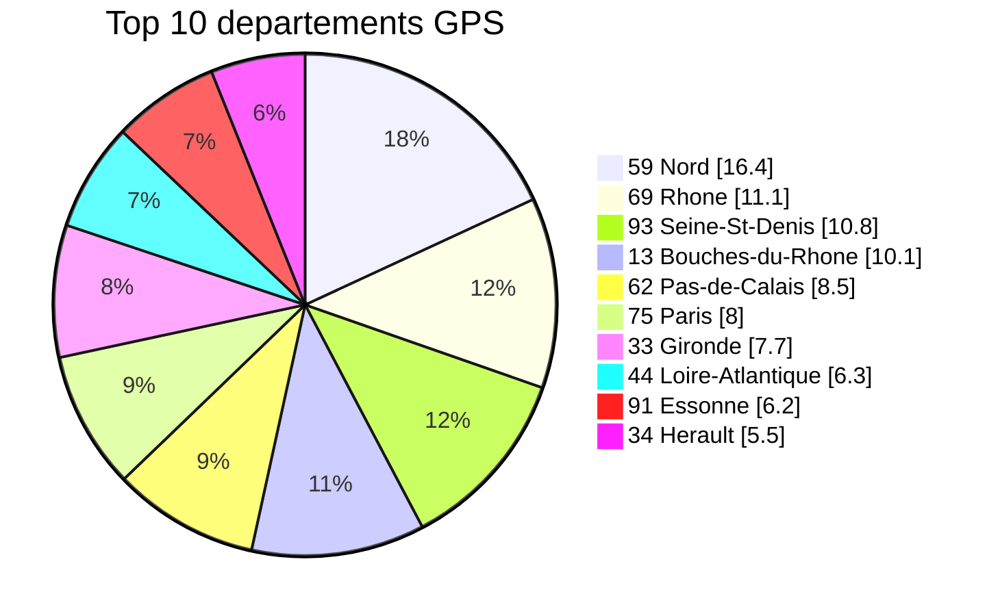
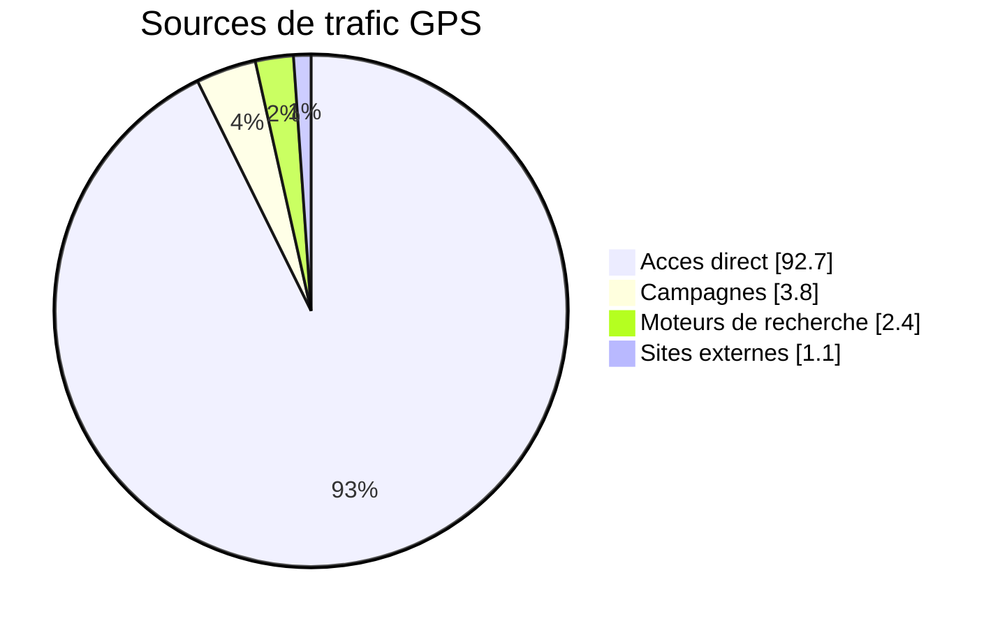
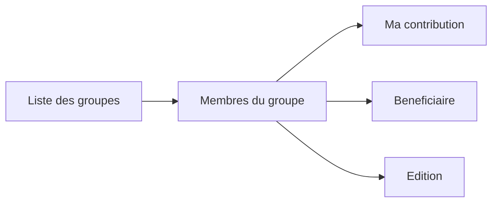
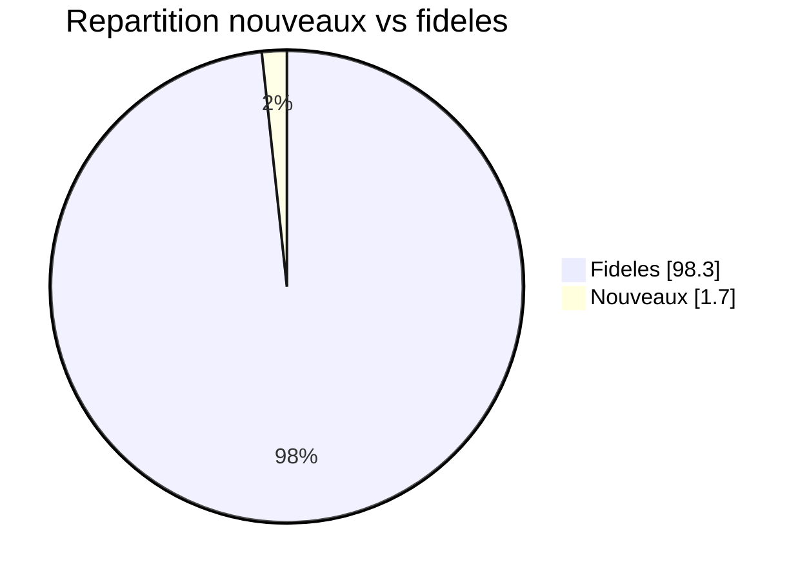
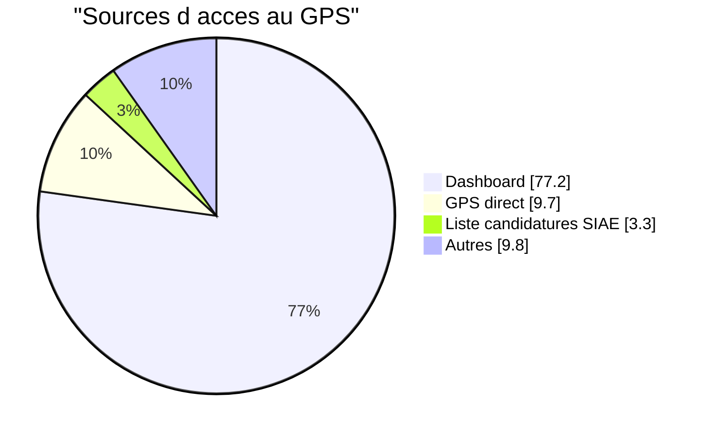
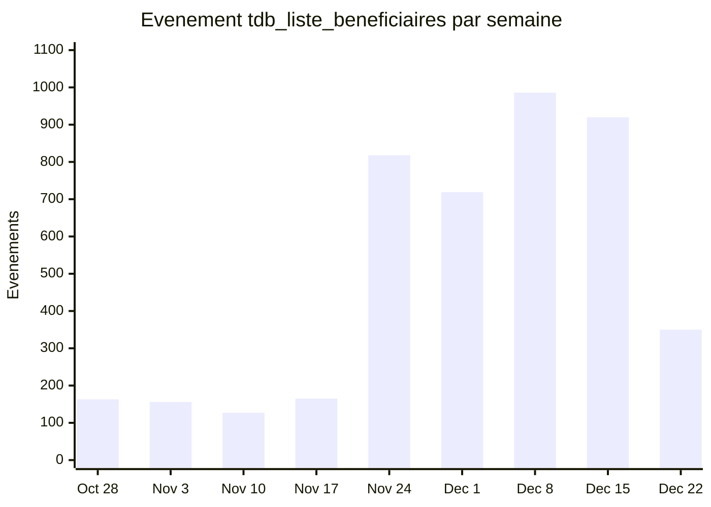

# Évolution de l'utilisation du GPS / Réseau d'intervenants

**Site :** les Emplois (emplois.inclusion.beta.gouv.fr)
**Période analysée :** Janvier - Décembre 2025
**Date du rapport :** 6 janvier 2026 (mise à jour)

## Résumé exécutif

Le GPS (Groupes Professionnels de Suivi), ou "réseau d'intervenants", a connu une **croissance spectaculaire en 2025**, particulièrement au dernier trimestre :

- **Visiteurs uniques multipliés par 4** entre janvier (793) et décembre 2025 (3 059)
- **Visites multipliées par 4** de 937 (janvier) à 3 829 (décembre)
- **Engagement exceptionnel** : 98% d'utilisateurs fidèles, ~35 actions/visite
- **Adoption forte par les prescripteurs** (57% des visites en décembre)

---

## 1. Évolution du trafic mensuel

### 1.1 Visiteurs uniques et visites

| Mois | Visiteurs uniques | Visites | Actions/visite | Temps moyen (min) |
|------|------------------:|--------:|---------------:|------------------:|
| Jan  | 793               | 937     | 33.6           | 20:46             |
| Fév  | 766               | 900     | 31.1           | 18:01             |
| Mar  | 701               | 855     | 36.3           | 20:06             |
| Avr  | 661               | 790     | 34.5           | 19:28             |
| Mai  | 495               | 606     | 34.2           | 21:13             |
| Jun  | 691               | 790     | 30.7           | 16:45             |
| Jul  | 491               | 572     | 38.1           | 20:13             |
| Aoû  | 339               | 339     | 43.5           | 22:44             |
| Sep  | 803               | 803     | 30.5           | 17:20             |
| **Oct** | **1 659**     | **2 979** | 25.1         | 14:36             |
| **Nov** | **1 517**     | **2 040** | 30.0         | 16:34             |
| **Déc** | **3 059**     | **3 829** | 37.5         | 19:49             |

**Data source:** [View in Matomo](https://matomo.inclusion.beta.gouv.fr/index.php?module=CoreHome&action=index&idSite=117&period=month&date=2025-12-01#?idSite=117&period=month&date=2025-01-01,2025-12-31&segment=pageUrl%253D%2540%252Fgps%252F&category=General_Visitors&subcategory=General_Overview) | `VisitsSummary.get?idSite=117&period=month&date=2025-01-01,2025-12-31&segment=pageUrl%3D%40%2Fgps%2F`

### 1.2 Graphique d'évolution



**Points clés :**
- **T1 2025** : Base stable autour de 700-800 visiteurs/mois
- **Été** : Baisse saisonnière classique (minimum en août : 339)
- **Octobre** : Doublement soudain (1 659 visiteurs) → probable déploiement ou campagne
- **Décembre** : Explosion à 3 059 visiteurs (+85% vs novembre)

---

## 2. Événements GPS

Les événements trackés dans la catégorie "gps" mesurent les interactions clés des utilisateurs.

### 2.1 Volume mensuel d'événements

| Mois | Événements | Évolution |
|------|----------:|----------:|
| Jan  | 1 176     | baseline  |
| Fév  | 1 154     | -2%       |
| Mar  | 1 020     | -12%      |
| Avr  | 974       | -4%       |
| Mai  | 679       | -30%      |
| Jun  | 898       | +32%      |
| Jul  | 792       | -12%      |
| Aoû  | 530       | -33%      |
| Sep  | 971       | +83%      |
| Oct  | 824       | -15%      |
| Nov  | 1 325     | +61%      |
| **Déc** | **3 904** | **+195%** |

**Data source:** [View in Matomo](https://matomo.inclusion.beta.gouv.fr/index.php?module=CoreHome&action=index&idSite=117&period=month&date=2025-12-01#?idSite=117&period=month&date=2025-01-01,2025-12-31&category=General_Actions&subcategory=Events_Events) | `Events.getCategory?idSite=117&period=month&date=2025-01-01,2025-12-31`

### 2.2 Types d'événements trackés

D'après le code source, les événements GPS sont :

| Action | Nom | Description |
|--------|-----|-------------|
| clic | `displayed_member_phone` | Affichage d'un numéro de téléphone |
| clic | `copied_user_email` | Copie d'une adresse email |
| clic | `consulter_fiche_candidat` | Consultation de la fiche candidat |

Ces événements traduisent des **actions de mise en relation** entre professionnels.

---

## 3. Segmentation par type d'utilisateur

### 3.1 Répartition des visites (décembre 2025)



| Type | Visites | % | Actions/visite | Temps moyen |
|------|--------:|--:|---------------:|------------:|
| Prescripteur | 2 195 | 57.4% | 33.6 | 16:19 |
| Employeur | 1 455 | 38.0% | 43.7 | 24:05 |
| Anonyme | 166 | 4.3% | 37.5 | 29:48 |
| Inspecteur du travail | 8 | 0.2% | 10.0 | 6:20 |
| Itou staff | 5 | 0.1% | 3.6 | 4:12 |

**Data source:** [View in Matomo](https://matomo.inclusion.beta.gouv.fr/index.php?module=CoreHome&action=index&idSite=117&period=month&date=2025-12-01#?idSite=117&period=month&date=2025-12-01&segment=pageUrl%253D%2540%252Fgps%252F&category=General_Visitors&subcategory=CustomDimensions_CustomDimensions) | `CustomDimensions.getCustomDimension?idDimension=1&idSite=117&period=month&date=2025-12-01&segment=pageUrl%3D%40%2Fgps%2F`

### 3.2 Comparaison janvier vs décembre 2025



**Observation :** Les prescripteurs ont pris une place plus importante dans l'usage du GPS au fil de l'année (+4 points).

### 3.3 Comportements distinctifs

| Indicateur | Prescripteurs | Employeurs |
|------------|-------------:|----------:|
| Actions/visite | 33.6 | 43.7 |
| Temps moyen | 16 min | 24 min |
| Taux de rebond | 1% | 1% |

Les **employeurs** passent **50% plus de temps** sur le GPS et réalisent **30% plus d'actions** par visite que les prescripteurs, suggérant un usage plus intensif mais par une population plus restreinte.

### 3.4 Types d'organisations (décembre 2025)

La dimension "UserOrganizationKind" permet d'identifier le type de structure auquel appartient l'utilisateur.



| Type | Nom complet | Visites | % |
|------|-------------|--------:|--:|
| FT | France Travail | 11 752 | 26.0% |
| ACI | Atelier Chantier d'Insertion | 5 815 | 12.9% |
| AI | Association Intermédiaire | 3 542 | 7.8% |
| ML | Mission Locale | 3 438 | 7.6% |
| EI | Entreprise d'Insertion | 2 870 | 6.4% |
| ETTI | Entreprise Travail Temporaire d'Insertion | 2 862 | 6.3% |
| Autre | Autre organisation | 2 233 | 4.9% |
| (non défini) | Valeur non renseignée | 2 002 | 4.4% |
| DEPT | Conseil Départemental | 1 565 | 3.5% |
| CHRS | Centre Hébergement Réinsertion Sociale | 1 478 | 3.3% |
| ODC | Organisation Délégataire Conventionnée | 1 115 | 2.5% |
| PLIE | Plan Local Insertion Emploi | 1 070 | 2.4% |
| CAP_EMPLOI | Cap Emploi | 669 | 1.5% |
| CCAS | Centre Communal Action Sociale | 538 | 1.2% |
| Autres... | (CHU, CPH, GEIQ, SPIP, CIDFF, etc.) | ~2 000 | ~4.4% |

**Data source:** [View in Matomo](https://matomo.inclusion.beta.gouv.fr/index.php?module=CoreHome&action=index&idSite=117&period=month&date=2025-12-01#?idSite=117&period=month&date=2025-12-01&segment=pageUrl%253D%2540%252Fgps%252F&category=General_Visitors&subcategory=CustomDimensions_CustomDimensions) | `CustomDimensions.getCustomDimension?idDimension=3&idSite=117&period=month&date=2025-12-01&segment=pageUrl%3D%40%2Fgps%2F`

**Observations :**
- **France Travail domine** avec 26% des visites – cohérent avec leur rôle central dans l'accompagnement
- **Les SIAE** (ACI, AI, EI, ETTI) représentent ensemble **33%** des visites → forte adoption côté employeurs IAE
- **Missions Locales** (7.6%) sont le 4e type d'organisation le plus actif
- Les structures d'hébergement (CHRS, CHU, CPH, CADA) représentent ~5% → usage pour le suivi de publics vulnérables

---

## 4. Analyse géographique

### 4.1 Top 10 des départements (décembre 2025)

| Rang | Dép. | Nom | Visites | % total |
|-----:|-----:|-----|--------:|--------:|
| 1 | 59 | Nord | 2 509 | 16.4% |
| 2 | 69 | Rhône | 1 702 | 11.1% |
| 3 | 93 | Seine-Saint-Denis | 1 648 | 10.8% |
| 4 | 13 | Bouches-du-Rhône | 1 541 | 10.1% |
| 5 | 62 | Pas-de-Calais | 1 294 | 8.5% |
| 6 | 75 | Paris | 1 216 | 8.0% |
| 7 | 33 | Gironde | 1 172 | 7.7% |
| 8 | 44 | Loire-Atlantique | 967 | 6.3% |
| 9 | 91 | Essonne | 951 | 6.2% |
| 10 | 34 | Hérault | 839 | 5.5% |

**Data source:** [View in Matomo](https://matomo.inclusion.beta.gouv.fr/index.php?module=CoreHome&action=index&idSite=117&period=month&date=2025-12-01#?idSite=117&period=month&date=2025-12-01&segment=pageUrl%253D%2540%252Fgps%252F&category=General_Visitors&subcategory=CustomDimensions_CustomDimensions) | `CustomDimensions.getCustomDimension?idDimension=4&idSite=117&period=month&date=2025-12-01&segment=pageUrl%3D%40%2Fgps%2F`

### 4.2 Répartition géographique



**Concentration remarquable :**
- **Nord** (dép. 59) représente à lui seul **16.4%** du trafic GPS
- Les Hauts-de-France (59+62) = **25%** du trafic
- L'Île-de-France (75+91+93+94+77) = **~33%** du trafic
- **Top 10 départements = 90%** du trafic total

---

## 5. Sources de trafic et campagnes

### 5.1 Répartition par source (décembre 2025)



| Source | Visites | % |
|--------|--------:|--:|
| Accès direct | 3 550 | 92.7% |
| Campagnes (liens traqués) | 146 | 3.8% |
| Moteurs de recherche | 90 | 2.4% |
| Sites externes | 43 | 1.1% |

**Data source:** [View in Matomo](https://matomo.inclusion.beta.gouv.fr/index.php?module=CoreHome&action=index&idSite=117&period=month&date=2025-12-01#?idSite=117&period=month&date=2025-12-01&segment=pageUrl%253D%2540%252Fgps%252F&category=Referrers_Referrers&subcategory=Referrers_WidgetGetAll) | `Referrers.getReferrerType?idSite=117&period=month&date=2025-12-01&segment=pageUrl%3D%40%2Fgps%2F`

### 5.2 Détail des campagnes (décembre 2025)

| Campagne | Visites | Actions/visite | Taux rebond |
|----------|--------:|---------------:|------------:|
| `mailing-gps-t425` | 135 | 20.9 | 12.6% |
| `export-donnees` | 10 | 34.9 | 0% |
| `afpa` | 1 | 2.0 | 0% |

**Data source:** [View in Matomo](https://matomo.inclusion.beta.gouv.fr/index.php?module=CoreHome&action=index&idSite=117&period=month&date=2025-12-01#?idSite=117&period=month&date=2025-12-01&segment=pageUrl%253D%2540%252Fgps%252F&category=Referrers_Referrers&subcategory=Referrers_Campaigns) | `Referrers.getCampaigns?idSite=117&period=month&date=2025-12-01&segment=pageUrl%3D%40%2Fgps%2F`

### 5.3 Impact des campagnes sur l'acquisition

**Constat principal :** Le trafic GPS provient quasi exclusivement d'**accès directs** (93%), ce qui signifie :
- Les utilisateurs accèdent au GPS depuis leur dashboard ou via des favoris
- Le GPS est une fonctionnalité "interne" utilisée par des utilisateurs déjà authentifiés
- Les campagnes jouent un rôle **marginal** dans l'acquisition (3.8% du trafic)

**Campagne `mailing-gps-t425` :**
- Campagne email dédiée au GPS lancée au T4 2025
- 135 visites générées en décembre
- **Taux de rebond élevé** (12.6%) comparé à la moyenne GPS (1%) → les destinataires du mailing sont moins engagés que les utilisateurs organiques
- Sources : envois via Brevo (sendibm1.com, sp1-brevo.net)

**Évolution novembre → décembre :**
- Novembre : campagne `export-donnees` dominante (59 visites)
- Décembre : lancement de `mailing-gps-t425` (135 visites)

**Conclusion :** L'explosion du trafic GPS en décembre (+85% vs novembre) n'est **pas due aux campagnes**. Les 146 visites campagnes représentent moins de 4% des 3 829 visites totales. La croissance provient donc d'autres facteurs : déploiement fonctionnel, bouche-à-oreille, formations, ou communication non trackée.

---

## 6. Pages GPS les plus consultées

### 6.1 Classement des URLs (décembre 2025)

| Page | Visites | Pages vues |
|------|--------:|-----------:|
| `/gps/groups/list` | 3 268 | 5 969 |
| `/gps/groups/{id}/memberships` | 1 629 | 3 940 |
| `/gps/groups/{id}/contribution` | 939 | 1 746 |
| `/gps/groups/{id}/beneficiary` | 847 | 1 303 |
| `/gps/groups/{id}/edition` | 732 | 1 363 |
| `/gps/groups/old/list` | 443 | 569 |
| `/gps/groups/join` | 126 | 166 |
| `/gps/groups/join/from-coworker` | 37 | 52 |
| `/gps/groups/join/from-nir` | 29 | 57 |

**Data source:** [View in Matomo](https://matomo.inclusion.beta.gouv.fr/index.php?module=CoreHome&action=index&idSite=117&period=month&date=2025-12-01#?idSite=117&period=month&date=2025-12-01&segment=pageUrl%253D%2540%252Fgps%252F&category=General_Actions&subcategory=General_Pages) | `Actions.getPageUrls?idSite=117&period=month&date=2025-12-01&segment=pageUrl%3D%40%2Fgps%2F&flat=1`

### 6.2 Parcours type



**Correspondance des URLs :**
- Liste des groupes → `/gps/groups/list`
- Membres du groupe → `/gps/groups/{id}/memberships`
- Ma contribution → `/gps/groups/{id}/contribution`
- Bénéficiaire → `/gps/groups/{id}/beneficiary`
- Édition → `/gps/groups/{id}/edition`

---

## 7. Fidélité des utilisateurs

### 7.1 Nouveaux vs fidèles (décembre 2025)



| Métrique | Nouveaux | Fidèles |
|----------|--------:|---------:|
| Visites | 67 | 3 762 |
| Visiteurs uniques | 67 | 2 997 |
| Actions/visite | 34.8 | 37.6 |
| Taux de rebond | 0% | 1% |

**Data source:** [View in Matomo](https://matomo.inclusion.beta.gouv.fr/index.php?module=CoreHome&action=index&idSite=117&period=month&date=2025-12-01#?idSite=117&period=month&date=2025-12-01&segment=pageUrl%253D%2540%252Fgps%252F&category=General_Visitors&subcategory=VisitFrequency_SubmenuFrequency) | `VisitFrequency.get?idSite=117&period=month&date=2025-12-01&segment=pageUrl%3D%40%2Fgps%2F`

**Interprétation :** Le GPS est utilisé quasi exclusivement par des utilisateurs fidèles. Cela suggère :
- Une **courbe d'apprentissage** : les utilisateurs reviennent après avoir découvert l'outil
- Un **usage professionnel régulier**, pas de consultation ponctuelle
- Un **taux d'activation faible** mais un **taux de rétention exceptionnel**

---

## 8. Comment les utilisateurs accèdent au GPS

### 8.1 Pages d'entrée (décembre 2025)

D'où viennent les utilisateurs qui consultent le GPS ?



| Page d'entrée | Visites | % |
|---------------|--------:|--:|
| `/dashboard/` | 2 670 | 77,2% |
| `/gps/groups/list` (accès direct/favori) | 334 | 9,7% |
| `/apply/siae/list` (liste candidatures reçues) | 114 | 3,3% |
| `/job-seekers/<session>/sender/check-nir` | 64 | 1,8% |
| `/apply/prescriptions/list` | 56 | 1,6% |
| `/apply/*/siae/details` (fiche candidature) | 39 | 1,1% |
| `/job-seekers/list` | 35 | 1,0% |
| Autres | ~148 | 4,3% |

**Data source:** [View in Matomo](https://stats.inclusion.beta.gouv.fr/index.php?module=CoreHome&action=index&idSite=117&period=month&date=2025-12-01#?idSite=117&period=month&date=2025-12-01&segment=pageUrl%253D%2540%252Fgps%252F&category=General_Actions&subcategory=Actions_SubmenuPagesEntry) | `Actions.getEntryPageUrls?idSite=117&period=month&date=2025-12-01&segment=pageUrl%3D%40%2Fgps%2F&flat=1`

**Interprétation :** Le **dashboard est la porte d'entrée principale** (77%) vers le GPS. L'accès depuis les fiches candidature (`/apply/*/siae/details`) reste marginal (1,1%), malgré l'ajout récent d'un lien.

### 8.2 Impact du déplacement du lien vers le menu (25 novembre 2025)

Le 25 novembre, le lien vers la liste des bénéficiaires GPS a été déplacé du dashboard vers la sidebar (menu principal). Ce clic déclenche l'événement `tdb_liste_beneficiaires`.

**Évolution hebdomadaire :**

| Semaine | `tdb_liste_beneficiaires` | Commentaire |
|---------|-------------------------:|-------------|
| Oct 28 - Nov 3 | 163 | Baseline |
| Nov 3-9 | 156 | Baseline |
| Nov 10-16 | 127 | Baseline |
| Nov 17-23 | 165 | **Dernière semaine avant changement** |
| **Nov 24-30** | **818** | **⬆️ Changement le 25** |
| Déc 1-7 | 719 | Nouveau niveau |
| Déc 8-14 | 986 | Nouveau niveau |
| Déc 15-21 | 920 | Nouveau niveau |
| Déc 22-28 | 350 | Fêtes |



**Résultat :**
- **Avant** (7 semaines) : 1 114 événements, soit **159/semaine** en moyenne
- **Après** (4 semaines) : 3 443 événements, soit **861/semaine** en moyenne
- **Augmentation : +441%**

Le déplacement vers le menu a multiplié par **5x** l'utilisation du lien.

**Data source:** [View in Matomo](https://stats.inclusion.beta.gouv.fr/index.php?module=CoreHome&action=index&idSite=117&period=week&date=2025-11-24#?idSite=117&period=week&date=2025-11-24&category=General_Actions&subcategory=Events_Events) | `Events.getName?idSite=117&period=week&date=2025-11-24`

### 8.3 Accès depuis les fiches candidature

Un lien vers le GPS a été ajouté sur les pages `/apply/*/siae/details` (fiche détaillée d'une candidature côté SIAE).

**Évolution hebdomadaire des entrées GPS depuis cette page :**

| Semaine | Entrées depuis `/apply/*/siae/details` | Total GPS | % |
|---------|--------------------------------------:|----------:|--:|
| Nov 3-9 | 1 | 968 | 0,1% |
| Nov 10-16 | 2 | 176 | 1,1% |
| Nov 17-23 | 1 | 165 | 0,6% |
| Nov 24-30 | 12 | 628 | 1,9% |
| Déc 1-7 | 6 | 568 | 1,1% |
| Déc 8-14 | 9 | 874 | 1,0% |
| Déc 15-21 | 15 | 1 236 | 1,2% |

**Constat :** L'accès depuis les fiches candidature reste **très marginal** (1-2% des entrées GPS). Le lien existe mais n'est pas un vecteur significatif d'acquisition vers le GPS.

---

## 9. Synthèse et recommandations

### 9.1 Points forts

1. **Croissance explosive T4 2025** : le GPS passe d'un outil de niche (~700 utilisateurs) à une fonctionnalité majeure (3 000+ utilisateurs)
2. **Engagement exceptionnel** : 35+ actions/visite, 20+ minutes de temps passé
3. **Fidélité remarquable** : 98% d'utilisateurs récurrents
4. **Adoption par les prescripteurs** : le profil cible principal utilise massivement l'outil
5. **Impact UX mesuré** : le déplacement du lien vers la sidebar (+441% de clics) prouve l'efficacité des changements de navigation

### 9.2 Points d'attention

1. **Concentration géographique forte** : 10 départements = 90% du trafic. Quid des autres territoires ?
2. **Faible acquisition de nouveaux utilisateurs** : seulement 1.7% de nouveaux en décembre
3. **Creux estival marqué** : -50% d'usage en août
4. **Lien candidature → GPS peu utilisé** : l'accès depuis les fiches candidature reste marginal (1%)

### 9.3 Pistes d'investigation

- **Octobre 2025** : Qu'est-ce qui explique le doublement du trafic ? Déploiement ? Formation ? Communication ?
- **Décembre 2025** : L'explosion (+85% vs novembre) coïncide avec le déplacement du lien dans la sidebar (25 nov), mais l'augmentation des clics sur ce lien n'explique pas tout le gain de trafic
- **Nord (59)** : Pourquoi ce département représente 16% du trafic GPS ?
- **Lien fiche candidature** : Pourquoi si peu utilisé ? Visibilité insuffisante ? Contexte d'usage différent ?

---

## Annexe : Requêtes API utilisées

```bash
# Visites mensuelles GPS
curl "https://matomo.../index.php?module=API&method=VisitsSummary.get&idSite=117&period=month&date=2025-01-01,2025-12-31&segment=pageUrl%3D%40%2Fgps%2F&format=json&token_auth=..."

# Répartition par type d'utilisateur
curl "https://matomo.../index.php?module=API&method=CustomDimensions.getCustomDimension&idDimension=1&idSite=117&period=month&date=2025-12-01&segment=pageUrl%3D%40%2Fgps%2F&format=json&token_auth=..."

# Distribution géographique
curl "https://matomo.../index.php?module=API&method=CustomDimensions.getCustomDimension&idDimension=4&idSite=117&period=month&date=2025-12-01&segment=pageUrl%3D%40%2Fgps%2F&format=json&token_auth=..."

# Événements GPS
curl "https://matomo.../index.php?module=API&method=Events.getCategory&idSite=117&period=month&date=2025-01-01,2025-12-31&format=json&token_auth=..."
```
