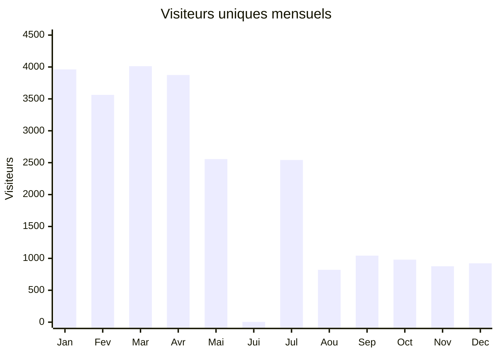
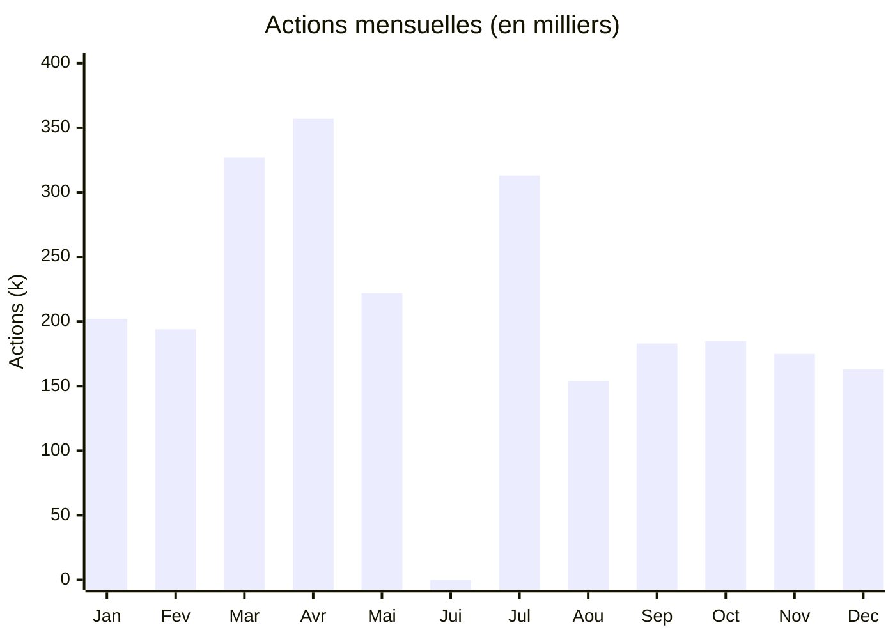
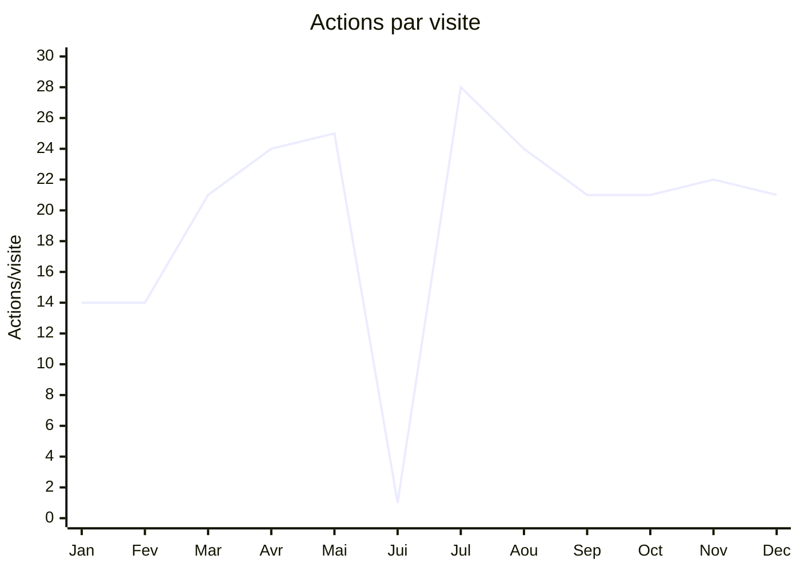

# Évolution des visiteurs et actions sur RDV-Insertion (2025)

## Synthèse

RDV-Insertion a connu **deux phases distinctes** en 2025 :
- **T1-T2** : Trafic élevé (3 500-4 000 visiteurs uniques/mois)
- **T3-T4** : Trafic réduit (800-1 000 visiteurs uniques/mois) mais engagement accru

⚠️ **Anomalie juin 2025** : Probable problème de tracking (4 visiteurs seulement).

## Évolution des visiteurs uniques

## Évolution des actions

## Données détaillées

| Mois | Visiteurs uniques | Visites | Actions | Actions/visite |
|------|------------------:|--------:|--------:|---------------:|
| Jan 2025 | 3 962 | 14 648 | 201 650 | 13,8 |
| Fév 2025 | 3 563 | 13 617 | 194 135 | 14,3 |
| Mar 2025 | 4 013 | 15 739 | 327 127 | 20,8 |
| Avr 2025 | 3 874 | 14 954 | 357 364 | 23,9 |
| Mai 2025 | 2 556 | 8 851 | 222 379 | 25,1 |
| Jun 2025 | 4 | 5 | 6 | 1,2 |
| Jul 2025 | 2 542 | 11 264 | 313 415 | 27,8 |
| Aoû 2025 | 820 | 6 499 | 154 145 | 23,7 |
| Sep 2025 | 1 043 | 8 738 | 183 084 | 21,0 |
| Oct 2025 | 980 | 8 979 | 185 198 | 20,6 |
| Nov 2025 | 877 | 8 091 | 175 308 | 21,7 |
| Déc 2025 | 923 | 7 784 | 163 125 | 21,0 |

## Engagement par visiteur

**Observation clé** : L'engagement par visite a fortement augmenté entre janvier (14 actions/visite) et juillet (28 actions/visite), puis s'est stabilisé autour de 21-22 actions/visite. Les utilisateurs actuels sont moins nombreux mais plus actifs.

## Interprétation

1. **Baisse des visiteurs uniques** : De ~4 000 en T1 à ~900 en T4 (-77%)
2. **Maintien relatif des actions** : Les actions ont moins chuté que les visiteurs
3. **Engagement croissant** : Les utilisateurs restants sont des professionnels très engagés (agents de départements utilisant le service quotidiennement)

Cette évolution suggère une consolidation de la base utilisateurs vers un noyau d'utilisateurs professionnels fidèles.

---

**Source des données :** [Voir dans Matomo](https://matomo.inclusion.beta.gouv.fr/index.php?module=CoreHome&action=index&idSite=214&period=month&date=2025-12-01#?idSite=214&period=month&date=2025-01-01,2025-12-31&category=Dashboard_Dashboard&subcategory=1) | `VisitsSummary.get?idSite=214&period=month&date=2025-01-01,2025-12-31`
