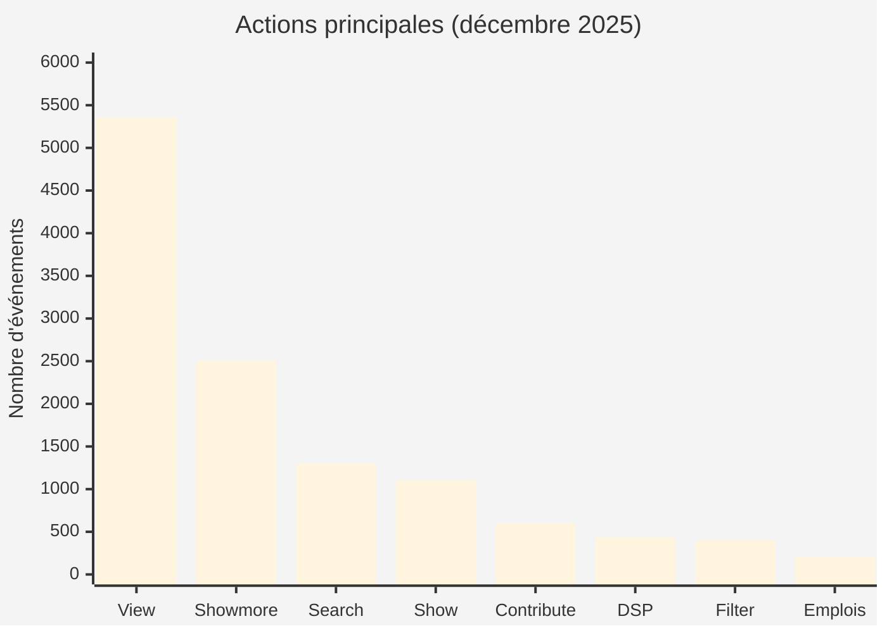
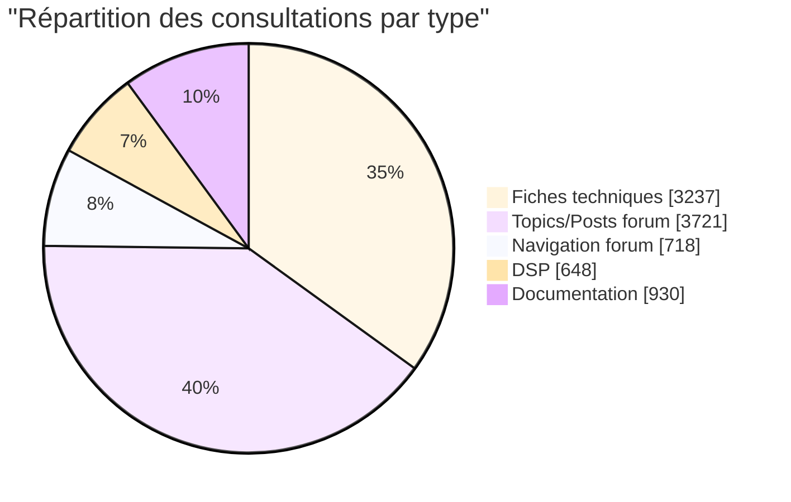
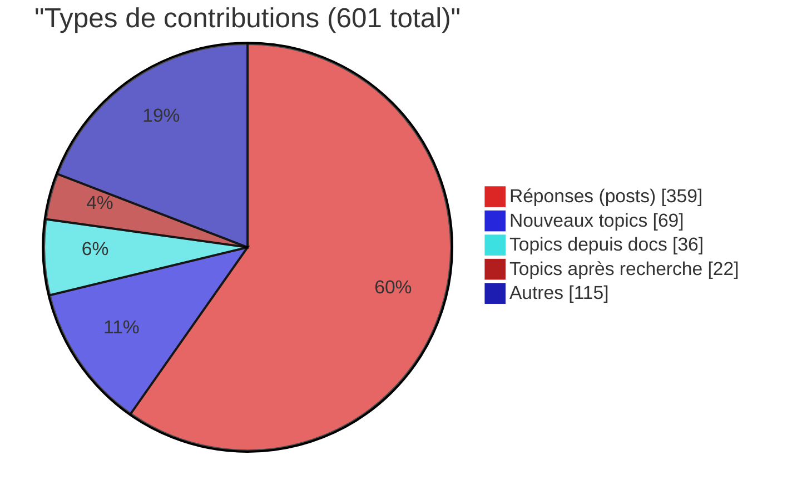

# Communauté : Actions et thématiques populaires

**Période analysée :** Décembre 2025
**Site :** https://communaute.inclusion.gouv.fr (Matomo ID: 206)

## Résumé exécutif

La Communauté de l'inclusion est un espace d'échange pour les professionnels de l'insertion. En décembre 2025, le site a enregistré **21 321 visiteurs uniques** et **26 671 visites**.

**Points clés :**
- La **consultation de fiches techniques** domine les interactions (3 200+ événements)
- Les thématiques **CDI inclusion** et **droits chômage** concentrent l'intérêt
- Le **diagnostic socio-professionnel (DSP)** génère un engagement fort (436 utilisations)
- **601 contributions** dont 69 nouveaux sujets créés

---

## 1. Actions principales des visiteurs

Les événements Matomo révèlent comment les utilisateurs interagissent avec le site.

### Détail des actions

| Action | Événements | % du total | Description |
|--------|------------|------------|-------------|
| **view** | 5 360 | 44% | Consultation de contenus (topics, fiches, docs) |
| **showmore** | 2 507 | 21% | Expansion de contenu ("Lire la suite") |
| **search** | 1 300 | 11% | Recherches effectuées |
| **show** | 1 105 | 9% | Affichage des fiches techniques |
| **contribute** | 601 | 5% | Création de posts et topics |
| **dsp** | 436 | 4% | Diagnostic socio-professionnel |
| **filter** | 397 | 3% | Filtrage de contenus |
| **emplois** | 209 | 2% | Liens vers les Emplois de l'inclusion |

**Interprétation :** Le comportement dominant est la **consultation** (view + showmore = 65%). La recherche active (search + filter) représente 14% des interactions. Les contributions (5%) montrent une communauté participative.

---

## 2. Contenus les plus consultés

### 2.1 Par type de contenu

### 2.2 Top 15 des pages

| # | Page | Visites | Type |
|---|------|---------|------|
| 1 | Espace d'échanges (topics) | 5 204 | Forum |
| 2 | Forum (index) | 1 909 | Navigation |
| 3 | CDI inclusion (topics) | 1 524 | Forum |
| 4 | Reprise droits chômage / droit d'option | 1 389 | Fiche |
| 5 | Documentation | 1 174 | Index |
| 6 | Créer un DSP | 1 136 | Outil |
| 7 | Boîte à outils CIP | 1 066 | Forum |
| 8 | Recherche | 1 026 | Outil |
| 9 | Connexion | 929 | Auth |
| 10 | Kit CIP certification | 828 | Forum |
| 11 | Diagnostic de territoire | 729 | Forum |
| 12 | CDI inclusion (fiche) | 694 | Fiche |
| 13 | Sorties dynamiques IAE | 689 | Forum |
| 14 | Parcours CIP | 653 | Forum |
| 15 | Diagnostic partagé | 642 | Forum |

---

## 3. Thématiques forum les plus visitées

| Forum | Visites |
|-------|---------|
| Espace échanges | 5 204 |
| CDI inclusion | 2 218 |
| Droits chômage | 1 389 |
| Boîte outils CIP | 1 066 |
| Kit CIP | 828 |
| Diag territoire | 729 |
| Sorties IAE | 689 |
| Parcours CIP | 653 |
| Diag partagé | 642 |
| ASS | 636 |

### Analyse par catégorie thématique

| Catégorie | Forums concernés | Visites cumulées |
|-----------|------------------|------------------|
| **Métier CIP** | Kit CIP, Parcours CIP, Boîte à outils, Postures accompagnement | 3 200+ |
| **Dispositifs IAE** | CDI inclusion, Sorties dynamiques, Pass IAE, Types de SIAE | 3 500+ |
| **Droits sociaux** | Reprise chômage, ASS | 2 000+ |
| **Méthodes** | Diagnostic territoire, Diagnostic partagé, Ateliers insertion | 1 800+ |
| **Outils** | Test 16 personnalités, Approche systémique, Questionnement DSP | 1 200+ |

**Tendance :** Les professionnels recherchent prioritairement des **informations pratiques sur les dispositifs** (CDI inclusion, droits chômage) et des **ressources métier** pour leur certification ou leur pratique quotidienne.

---

## 4. Contributions et activité communautaire

### 4.1 Volume de contributions

### 4.2 Engagement

| Indicateur | Valeur |
|------------|--------|
| Posts créés | 359 |
| Nouveaux topics | 127 (69 + 36 + 22) |
| Notes données (rate) | 117 |
| Upvotes | 6 |

**Ratio contribution/visite :** 2,2% des visites génèrent une contribution (601 / 26 671).

---

## 5. Diagnostic socio-professionnel (DSP)

Le DSP est un outil permettant aux accompagnateurs d'identifier les besoins des personnes accompagnées.

### 5.1 Utilisation

| Métrique | Valeur |
|----------|--------|
| Diagnostics soumis | 341 |
| Nouveaux diagnostics | 15 |
| Consultations page DSP | 307 |
| Visites création DSP | 1 136 |

### 5.2 Thématiques identifiées

Les clics sur les ressources après diagnostic révèlent les besoins des publics accompagnés :

| Besoin identifié | Clics |
|------------------|-------|
| Emploi | 18 |
| Français (pro) | 15 |
| Français (quotidien) | 8 |
| Handicap | 7 |
| Logement | 7 |
| Droits | 6 |
| Mobilité | 6 |

**Interprétation :** Les besoins les plus fréquents concernent l'**emploi** et l'**apprentissage du français**, suivis des problématiques de **handicap** et de **logement**.

---

## 6. Parcours de recherche

### 6.1 Volume de recherches

| Type | Événements |
|------|------------|
| Recherche header | 535 |
| Recherche formulaire | 693 |
| **Total** | **1 228** |

### 6.2 Actions post-recherche

- 22 utilisateurs ont créé un topic après une recherche infructueuse
- Les recherches génèrent 4 161 hits sur la page `/search/`

---

## 7. Liens vers l'écosystème

Les visiteurs utilisent Communauté comme passerelle vers les Emplois de l'inclusion :

| Lien | Clics |
|------|-------|
| Recherche prescripteur | 145 |
| Recherche entreprise | 64 |
| **Total** | **209** |

---

## Conclusions

### Forces
- **Contenu de référence** : Les fiches techniques et forums thématiques répondent à un besoin réel
- **Communauté active** : 600+ contributions mensuelles malgré un public professionnel occupé
- **Outil DSP** : Fort taux d'utilisation (341 diagnostics/mois)

### Points d'attention
- **Taux de rebond élevé** (67%) - de nombreux visiteurs ne consultent qu'une page
- **Engagement en baisse** : actions/visite passées de 3.3 à 2.5 sur l'année
- **Recherche** : 22 topics créés "après recherche" suggèrent des contenus manquants

### Recommandations
1. Analyser les termes de recherche pour identifier les contenus manquants
2. Améliorer le maillage entre fiches techniques et discussions forum
3. Mettre en avant les contenus CDI inclusion et droits sociaux (forte demande)

---

## Sources des données

**Période :** 2025-12-01 à 2025-12-31

| Donnée | Méthode API | Lien Matomo |
|--------|-------------|-------------|
| Pages | `Actions.getPageUrls` | [Voir](https://stats.inclusion.beta.gouv.fr/index.php?module=CoreHome&action=index&idSite=206&period=month&date=2025-12-01#?idSite=206&period=month&date=2025-12-01&segment=&category=General_Actions&subcategory=General_Pages) |
| Événements actions | `Events.getAction` | [Voir](https://stats.inclusion.beta.gouv.fr/index.php?module=CoreHome&action=index&idSite=206&period=month&date=2025-12-01#?idSite=206&period=month&date=2025-12-01&segment=&category=General_Actions&subcategory=Events_Events) |
| Événements noms | `Events.getName` | [Voir](https://stats.inclusion.beta.gouv.fr/index.php?module=CoreHome&action=index&idSite=206&period=month&date=2025-12-01#?idSite=206&period=month&date=2025-12-01&segment=&category=General_Actions&subcategory=Events_Events) |
| Résumé visites | `VisitsSummary.get` | [Voir](https://stats.inclusion.beta.gouv.fr/index.php?module=CoreHome&action=index&idSite=206&period=month&date=2025-12-01#?idSite=206&period=month&date=2025-12-01&segment=&category=General_Visitors&subcategory=General_Overview) |

