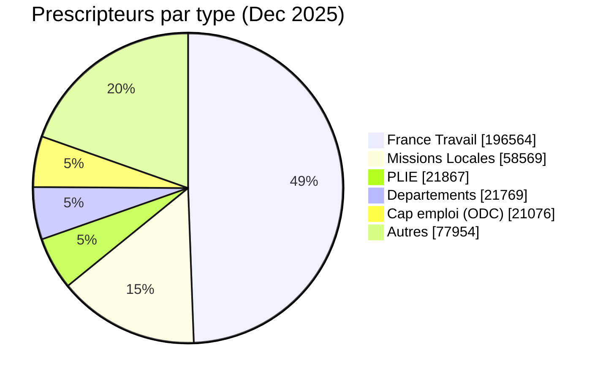
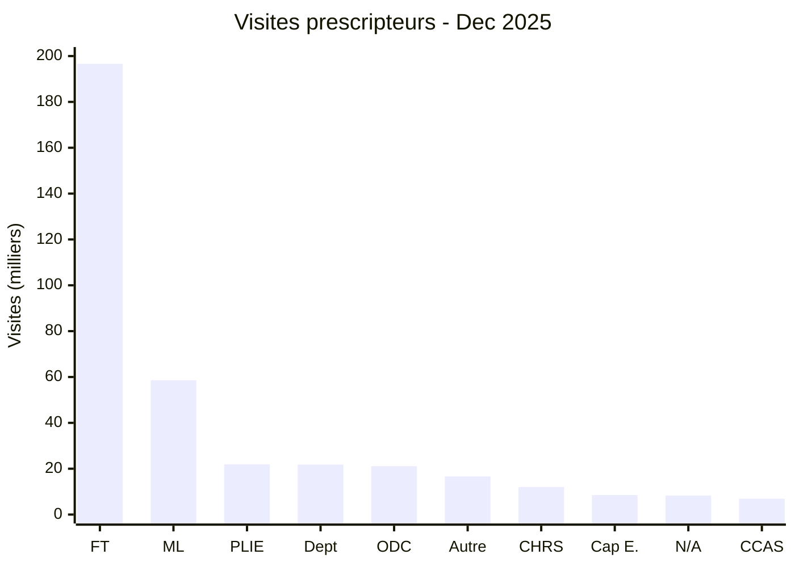

# Prescripteurs sur les Emplois par type d'organisation — Décembre 2025

## Synthèse

En décembre 2025, les prescripteurs ont effectué **397 799 visites** sur les Emplois.
France Travail représente à lui seul près de la moitié du trafic prescripteur (49,4%),
suivi des Missions Locales (14,7%).

## Répartition complète

| Type d'organisation | Visites | % | Description |
|---------------------|--------:|--:|-------------|
| **FT** | 196 564 | 49,4% | France Travail (ex-Pôle emploi) |
| **ML** | 58 569 | 14,7% | Missions Locales |
| **PLIE** | 21 867 | 5,5% | Plans Locaux pour l'Insertion et l'Emploi |
| **DEPT** | 21 769 | 5,5% | Conseils départementaux |
| **ODC** | 21 076 | 5,3% | Organismes délégataires de Cap emploi |
| **Autre** | 16 624 | 4,2% | Structures non classifiées |
| **CHRS** | 12 000 | 3,0% | Centres d'Hébergement et de Réinsertion Sociale |
| **CAP_EMPLOI** | 8 525 | 2,1% | Cap emploi (accompagnement handicap) |
| *Value not defined* | 8 265 | 2,1% | Non renseigné |
| **CCAS** | 6 918 | 1,7% | Centres Communaux d'Action Sociale |
| **CPH** | 3 791 | 1,0% | Centres Provisoires d'Hébergement |
| **CHU** | 2 830 | 0,7% | Centres d'Hébergement d'Urgence |
| **SPIP** | 2 418 | 0,6% | Services Pénitentiaires d'Insertion et Probation |
| **OCASF** | 2 104 | 0,5% | Organismes Conventionnés Action Sociale Facultative |
| **PREVENTION** | 1 832 | 0,5% | Services de prévention spécialisée |
| **CADA** | 1 820 | 0,5% | Centres d'Accueil pour Demandeurs d'Asile |
| **CIDFF** | 1 804 | 0,5% | Centres d'Information sur les Droits des Femmes et des Familles |
| **OHPD** | 1 713 | 0,4% | Organismes d'Hébergement de Personnes en Difficulté |
| **RS_FJT** | 1 388 | 0,3% | Résidences Sociales / Foyers de Jeunes Travailleurs |
| **OIL** | 1 290 | 0,3% | Opérateurs d'Intermédiation Locative |
| **PJJ** | 708 | 0,2% | Protection Judiciaire de la Jeunesse |
| **HUDA** | 583 | 0,1% | Hébergement d'Urgence pour Demandeurs d'Asile |
| **E2C** | 525 | 0,1% | Écoles de la 2e Chance |
| **CSAPA** | 419 | 0,1% | Centres de Soins, d'Accompagnement et de Prévention en Addictologie |
| **CAARUD** | 418 | 0,1% | Centres d'Accueil et d'Accompagnement à la Réduction des risques pour Usagers de Drogues |
| **EPIDE** | 390 | 0,1% | Établissement Pour l'Insertion Dans l'Emploi |
| **OACAS** | 342 | 0,1% | Organismes d'Accueil Communautaire et d'Action Sociale |
| **AFPA** | 283 | 0,1% | Agence nationale pour la Formation Professionnelle des Adultes |
| **PIJ_BIJ** | 266 | 0,1% | Points / Bureaux Information Jeunesse |
| **ASE** | 251 | 0,1% | Aide Sociale à l'Enfance |
| **PENSION** | 166 | <0,1% | Pensions de famille |
| **MSA** | 148 | <0,1% | Mutualité Sociale Agricole |
| **CAVA** | 82 | <0,1% | Centres d'Adaptation à la Vie Active |
| **CAF** | 51 | <0,1% | Caisses d'Allocations Familiales |
| **TOTAL** | **397 799** | **100%** | |

## Visualisations

### Répartition globale (camembert)



### Top 10 des types d'organisation (bar chart)



*Légende : FT=France Travail, ML=Missions Locales, Dept=Conseils départementaux, ODC=Cap emploi (org. délégataires), Cap E.=Cap emploi direct, N/A=Non renseigné*

## Observations

1. **Concentration** : les 5 premiers types d'organisation représentent **80,4%** du trafic prescripteur.

2. **France Travail domine** : avec près de 50% des visites, FT reste le premier prescripteur en volume.
   Ce chiffre est cohérent avec la baseline des diagnostics (58% des candidats accompagnés).

3. **Trafic hébergement significatif** : les structures d'hébergement (CHRS, CHU, CPH, CADA, HUDA, etc.)
   cumulent environ **21 000 visites** (5,3%), témoignant de l'importance de l'IAE pour les publics
   en grande précarité.

4. **Valeurs non définies** : 8 265 visites (2,1%) n'ont pas de type d'organisation renseigné.
   Cela peut indiquer des prescripteurs dont le profil est incomplet.

## Source des données

**Matomo** — Dimension personnalisée #3 (UserOrganizationKind), filtrée sur dimension1==prescriber

[Voir dans Matomo](https://matomo.inclusion.beta.gouv.fr/index.php?module=CustomDimensions&action=menuGetCustomDimension&idDimension=3&idSite=117&period=month&date=2025-12-01&segment=dimension1%3D%3Dprescriber)

```
API: CustomDimensions.getCustomDimension
idSite=117&period=month&date=2025-12-01&idDimension=3&segment=dimension1%3D%3Dprescriber
```
