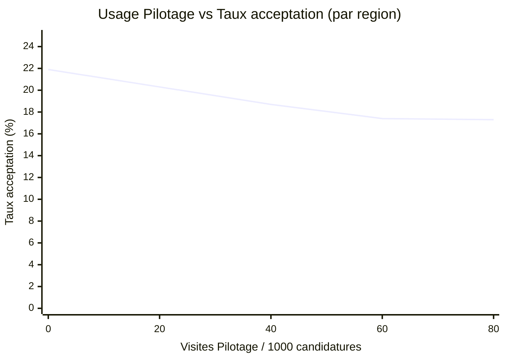

# Analyses alternatives : Usage de Pilotage et performance de recrutement

**Contexte :** Impossibilité de répondre directement à la question causale (voir rapport `2026-01-pilotage-impact-vitesse-recrutement.md`). Ce rapport présente trois analyses alternatives pour éclairer le sujet.

---

## 1. Profil des utilisateurs de Pilotage (Matomo, site ID 146)

### 1.1 Volume de trafic 2025

| Mois | Visiteurs uniques | Visites | Taux de rebond | Temps moyen |
|------|-------------------|---------|----------------|-------------|
| Janvier | 1 177 | 1 529 | 45% | 3m 02s |
| Février | 2 218 | 2 800 | 59% | 2m 25s |
| Mars | 1 010 | 1 363 | 43% | 3m 13s |
| Avril | - | - | - | - |
| Mai | 288 | 346 | 46% | 2m 36s |
| **Juin** | **5 731** | **6 460** | **43%** | **2m 09s** |
| Juillet | 1 239 | 1 572 | 51% | 1m 53s |
| Août | 710 | 876 | 53% | 2m 09s |
| Septembre | 3 226 | 3 958 | 38% | 2m 09s |
| Octobre | 1 462 | 1 905 | 53% | 2m 14s |
| Novembre | 975 | 1 266 | 52% | 2m 27s |
| Décembre | 686 | 921 | 42% | 5m 38s |

**Observations :**
- **Forte saisonnalité** : Pic en juin (5 731 visiteurs), creux en mai (288) et août (710)
- **Usage sporadique** : 9 à 191 visiteurs uniques/jour (vs 5 000+ pour Emplois)
- **Engagement modéré** : 38-59% de rebond, 2-3 actions/visite, 2-5 minutes par session
- **Pic de juin** : Probablement lié à une campagne de communication ou à un événement (ex: journée d'étude, webinaire)

**Source de données :** [Matomo Pilotage](https://matomo.inclusion.beta.gouv.fr/index.php?module=CoreHome&action=index&idSite=146&period=month&date=2025-01-01) | `VisitsSummary.get?idSite=146&period=month&date=2025-01-01,2025-12-31`

### 1.2 Pages les plus consultées (2025)

| Rang | Page | Visites | Temps moyen |
|------|------|---------|-------------|
| 1 | `/tableaux-de-bord-prives/` | 11 145 | 85s |
| 2 | `/` (accueil) | 6 025 | 35s |
| 3 | `/tableaux-de-bord/` | 5 117 | 34s |
| 4 | `/tableaux-de-bord/zoom-esat-2024/` | 2 196 | 74s |
| 5 | `/tableaux-de-bord/analyse-offre-insertion-sur-le-territoire/` | 1 245 | 97s |
| 6 | `/tableaux-de-bord/conventionnements-iae/` | 1 201 | 171s |
| 7 | `/tableaux-de-bord/zoom-employeurs/` | 1 121 | 95s |
| 8 | `/tableaux-de-bord/cartographies-iae/` | 981 | 52s |
| 9 | `/tableaux-de-bord/zoom-prescripteurs/` | 974 | 85s |
| 10 | `/tableaux-de-bord/metiers/` | 803 | 83s |
| 11 | `/tableaux-de-bord/postes-en-tension/` | 759 | 63s |
| 12 | `/tableaux-de-bord/zoom-esat-2025/` | 759 | 76s |
| 13 | `/tableaux-de-bord/etat-suivi-candidatures/` | 710 | 153s |
| 14 | `/tableaux-de-bord/bilan-candidatures-iae/` | 576 | 129s |
| 15 | `/tableaux-de-bord/candidat-file-active-IAE/` | 399 | 119s |

**Observations :**
- **Les tableaux de bord privés dominent** (11 145 visites, 85s) → Espace authentifié, usage professionnel
- **Temps de consultation élevé** sur les TDB spécialisés :
  - Conventionnements IAE : 171s (2m51s)
  - État et suivi des candidatures : 153s (2m33s)
  - Bilan des candidatures : 129s (2m09s)
- **Thématiques populaires** : ESAT (2 196 + 759 = 2 955 visites), employeurs (1 121), prescripteurs (974)
- **Pages opérationnelles moins consultées** : File active (399), auto-prescription (328), prolongations (168)

**Interprétation :** Les utilisateurs cherchent principalement des **vues d'ensemble stratégiques** (conventionnements, cartographies, zooms sectoriels) plutôt que des indicateurs opérationnels quotidiens.

**Source de données :** [Pages Pilotage](https://matomo.inclusion.beta.gouv.fr/index.php?module=Actions&action=getPageUrls&idSite=146&period=year&date=2025-01-01) | `Actions.getPageUrls?idSite=146&period=year&date=2025-01-01&flat=1&filter_limit=20`

### 1.3 Répartition géographique

| Rang | Région | Visites | % du total |
|------|--------|---------|------------|
| 1 | Île-de-France | 6 742 | 29.2% |
| 2 | Auvergne-Rhône-Alpes | 861 | 3.7% |
| 3 | Nouvelle-Aquitaine | 685 | 3.0% |
| 4 | Hauts-de-France | 604 | 2.6% |
| 5 | Occitanie | 458 | 2.0% |
| 6 | Centre-Val de Loire | 139 | 0.6% |
| 7 | Bourgogne-Franche-Comté | 80 | 0.3% |
| **Autres** | **Hors France métropolitaine** | **13 627** | **59.0%** |

**⚠️ Note importante :** 59% du trafic provient de l'étranger (États-Unis, Islande, Israël, etc.). Il s'agit probablement de :
- Trafic de bots/crawlers
- CDN et services cloud (Chicago, Ashburn = data centers)
- VPN d'entreprise
- Quelques visiteurs légitimes en déplacement

**Pour l'analyse française uniquement (9 569 visites) :**
- **Île-de-France écrase les autres régions** : 70% des visites françaises (6 742 / 9 569)
- **Grandes régions peu représentées** : PACA (0), Grand Est (0), Bretagne (0), Normandie (0)
- **Sous-représentation de certaines régions** malgré un volume important de candidatures (voir section 2.3)

**Source de données :** [Régions Pilotage](https://matomo.inclusion.beta.gouv.fr/index.php?module=UserCountry&action=getRegion&idSite=146&period=year&date=2025-01-01) | `UserCountry.getRegion?idSite=146&period=year&date=2025-01-01`

### 1.4 Sources de trafic

| Source | Visites | % |
|--------|---------|---|
| Entrée directe (URL tapée, favoris) | 11 209 | 48.6% |
| Sites web (referrers) | 10 039 | 43.5% |
| Moteurs de recherche | 1 549 | 6.7% |
| Campagnes (UTM) | 161 | 0.7% |
| Réseaux sociaux | 38 | 0.2% |

**Observations :**
- **Trafic principalement direct** (49%) → Utilisateurs réguliers qui connaissent l'URL
- **Forte part de referrers** (44%) → Liens depuis d'autres sites inclusion.gouv.fr ou documentation interne
- **Peu de découverte organique** (7% via moteurs de recherche) → Outil peu connu du grand public
- **Très peu de social media** (38 visites) → Pas de stratégie de communication sur réseaux

**Interprétation :** Pilotage est un **outil professionnel de niche**, connu par bouche-à-oreille ou documentation interne, pas un outil grand public.

**Source de données :** [Sources de trafic](https://matomo.inclusion.beta.gouv.fr/index.php?module=Referrers&action=getReferrerType&idSite=146&period=year&date=2025-01-01) | `Referrers.getReferrerType?idSite=146&period=year&date=2025-01-01`

---

## 2. Benchmark des performances de recrutement (Metabase)

### 2.1 Taux d'acceptation global

| Année | Candidatures totales | Acceptées | Refusées | Taux acceptation | Taux refus |
|-------|----------------------|-----------|----------|------------------|------------|
| 2024 | ~630 000 | 139 480 | 322 000 | **22.1%** | **51.1%** |
| 2025 | ~440 000 (YTD) | 77 700 | 266 000 | **17.7%** | **60.4%** |

**⚠️ Dégradation en 2025 :**
- **Baisse de 4.4 points du taux d'acceptation** (22.1% → 17.7%)
- **Hausse de 9.3 points du taux de refus** (51.1% → 60.4%)

**Hypothèses possibles :**
- Tensions sur le marché du travail (reprise économique, candidats plus exigeants)
- Changements de pratiques des SIAE
- Évolution du profil des candidats
- Données 2025 incomplètes (année en cours)

**Source de données :** [Taux acceptation/refus](https://stats.inclusion.beta.gouv.fr/question/7027) | Card 7027 `Taux d'acceptation et refus des prescriptions`

### 2.2 Taux d'acceptation par type de prescripteur (2024)

| Type de prescripteur | Candidatures | Acceptées | Taux |
|----------------------|--------------|-----------|------|
| **Employeurs (autoprescription)** | | | |
| Employeur AI | 22 859 | 21 426 | **93.7%** |
| Employeur ETTI | 24 796 | 23 180 | **93.5%** |
| Employeur EI | 5 995 | 5 156 | **86.0%** |
| Employeur ACI | 10 850 | 9 026 | **83.2%** |
| **Prescripteurs institutionnels** | | | |
| CCAS / CIAS | 7 616 | 2 091 | **27.5%** |
| Service social du conseil départemental | 26 038 | 6 533 | **25.1%** |
| Mission locale | 69 679 | 16 969 | **24.4%** |
| France Travail | 254 200 | 54 838 | **21.6%** |
| PLIE | 28 155 | 5 809 | **20.6%** |
| Cap emploi | 8 624 | 1 653 | **19.2%** |
| **Autres** | | | |
| Autre | 19 957 | 2 430 | **12.2%** |
| Orienteur sans organisation | 14 521 | 1 833 | **12.6%** |
| **Candidats autonomes** | 80 143 | 5 019 | **6.3%** |

**Observations clés :**

1. **Énorme écart employeurs vs prescripteurs** :
   - Employeurs (autoprescription) : **83-94%** d'acceptation
   - Prescripteurs institutionnels : **20-27%** d'acceptation
   - Candidats autonomes : **6.3%** seulement

2. **Explication probable** :
   - Les employeurs ne créent une candidature que s'ils ont déjà décidé d'embaucher (validation a posteriori)
   - Les prescripteurs envoient des candidatures exploratoires (matching incertain)
   - Les candidats autonomes postulent sans ciblage précis

3. **France Travail = plus gros volume** : 254 200 candidatures (40% du total), mais seulement 21.6% d'acceptation

**Source de données :** [Performance prescripteurs](https://stats.inclusion.beta.gouv.fr/) | SQL query sur table `candidatures_echelle_locale`

### 2.3 Performance par région (2025, données partielles)

| Rang | Région | Candidatures | Taux d'acceptation |
|------|--------|--------------|---------------------|
| 1 | Corse | 957 | **35.4%** |
| 2 | Martinique | 3 110 | **35.2%** |
| 3 | Guadeloupe | 1 436 | **25.3%** |
| 4 | Bourgogne-Franche-Comté | 23 908 | **21.9%** |
| 5 | Bretagne | 19 403 | **20.9%** |
| 6 | Pays de la Loire | 30 978 | **20.6%** |
| 7 | Nouvelle-Aquitaine | 43 637 | **20.3%** |
| 8 | Normandie | 23 928 | **18.7%** |
| 9 | Centre-Val de Loire | 15 791 | **18.7%** |
| 10 | Occitanie | 39 485 | **17.4%** |
| 11 | Auvergne-Rhône-Alpes | 62 333 | **17.3%** |
| 12 | Grand Est | 57 140 | **16.7%** |
| 13 | Hauts-de-France | 72 554 | **16.0%** |
| 14 | Provence-Alpes-Côte d'Azur | 46 859 | **15.5%** |
| 15 | La Réunion | 10 455 | **13.6%** |
| 16 | **Île-de-France** | **86 236** | **12.8%** |

**Observations :**

1. **Île-de-France = plus gros volume mais pire performance** :
   - 86 236 candidatures (19% du total national)
   - Taux d'acceptation de 12.8% (dernier rang métropole)

2. **Petites régions/DOM = meilleurs taux** :
   - Corse : 35.4% (mais 957 candidatures seulement)
   - Martinique : 35.2% (3 110 candidatures)
   - Effet de marché moins tendu ou de sélection différente ?

3. **Grandes régions industrielles = taux moyens** :
   - Hauts-de-France : 16.0% (72 554 candidatures)
   - PACA : 15.5% (46 859 candidatures)

**Hypothèse :** Les régions avec un **marché du travail tendu** (Île-de-France, PACA) ont des taux d'acceptation plus faibles. Les employeurs peuvent être plus sélectifs.

**Source de données :** [Performance régions](https://stats.inclusion.beta.gouv.fr/) | SQL query sur table `candidatures_echelle_locale` (2025)

---

## 3. Analyse de corrélation géographique (proxy)

**Question :** Y a-t-il un lien entre l'usage de Pilotage (visites) et les performances de recrutement (taux d'acceptation) au niveau régional ?

### 3.1 Données croisées (7 régions avec données Matomo + Metabase)

| Région | Visites Pilotage | Candidatures | Visites/1000 cand | Taux acceptation |
|--------|------------------|--------------|-------------------|------------------|
| **Île-de-France** | 6 742 | 86 236 | **78.2** | **12.8%** |
| Nouvelle-Aquitaine | 685 | 43 637 | 15.7 | 20.3% |
| Auvergne-Rhône-Alpes | 861 | 62 333 | 13.8 | 17.3% |
| Occitanie | 458 | 39 485 | 11.6 | 17.4% |
| Centre-Val de Loire | 139 | 15 791 | 8.8 | 18.7% |
| Hauts-de-France | 604 | 72 554 | 8.3 | 16.0% |
| Bourgogne-Franche-Comté | 80 | 23 908 | 3.3 | 21.9% |

### 3.2 Corrélation de Pearson



**Calcul avec les 7 régions :**
- **Corrélation de Pearson : -0.764** (corrélation négative forte)
- Interprétation : Les régions qui utilisent le plus Pilotage ont les **pires** taux d'acceptation

**⚠️ Mais attention : effet Île-de-France !**

L'Île-de-France est un **outlier massif** :
- 78 visites Pilotage / 1000 candidatures (10x la moyenne des autres régions)
- Taux d'acceptation de 12.8% (le plus faible)

**Calcul SANS Île-de-France :**
- **Corrélation de Pearson : -0.310** (corrélation faible négative, quasi nulle)
- Interprétation : Pour les 6 autres régions, **aucun lien clair** entre usage de Pilotage et performance

### 3.3 Interprétation

**Ce que cette analyse NE prouve PAS :**
- ❌ Utiliser Pilotage **cause** de mauvaises performances
- ❌ Pilotage est inefficace ou contre-productif

**Ce que cette analyse suggère :**

1. **L'Île-de-France utilise massivement Pilotage** (70% des visites françaises) **malgré des performances médiocres** :
   - Hypothèse 1 : Pilotage est consulté pour **comprendre** pourquoi les performances sont faibles (usage diagnostic)
   - Hypothèse 2 : L'Île-de-France a des **problèmes structurels** (marché tendu, volume élevé, candidats moins qualifiés) que Pilotage ne peut pas résoudre seul
   - Hypothèse 3 : Les professionnels parisiens ont **plus de temps/ressources** pour consulter des outils de pilotage

2. **Pour les autres régions, pas de lien observé** :
   - Usage de Pilotage et performance sont probablement tous deux **influencés par d'autres facteurs** (taille du territoire, dotation en moyens humains, politiques locales, etc.)
   - Ou bien l'effet de Pilotage existe mais est **trop faible** pour être détecté avec seulement 6 régions

3. **Limites méthodologiques majeures** :
   - **Biais de sélection** : Seules 7 régions ont suffisamment de visites Pilotage pour être analysées
   - **Données agrégées** : Impossible de distinguer qui utilise Pilotage (prescripteurs ? employeurs ? DDETS ?)
   - **Pas de dimension temporelle** : On ne sait pas si l'usage précède ou suit les performances
   - **Variables confondantes** : Région, type de marché du travail, dotation en SIAE, etc.

### 3.4 Conclusion sur la corrélation géographique

**Verdict :** Cette analyse de corrélation **ne permet PAS de conclure** sur l'efficacité de Pilotage.

La corrélation observée est probablement **spurieuse** (fausse) :
- Elle est entièrement portée par l'Île-de-France (outlier)
- Elle disparaît quand on retire cette région
- Elle ne tient pas compte des variables confondantes

**Pour établir un lien causal, il faudrait :**
- Comparer des utilisateurs vs non-utilisateurs **au sein d'une même région**
- Contrôler pour le type de structure, l'ancienneté, la taille
- Avoir une dimension temporelle (avant/après première utilisation)
- Mesurer l'intensité d'usage (fréquence, pages consultées, durée)

---

## 4. Synthèse et recommandations

### 4.1 Ce que nous savons

**Sur Pilotage :**
- Outil professionnel de niche : 9-191 visiteurs uniques/jour (vs 5 000+ pour Emplois)
- Usage sporadique avec forte saisonnalité (pic en juin 2025)
- Consultation principalement de tableaux de bord stratégiques (conventionnements, ESAT, cartographies)
- Temps de consultation élevé (2-3 minutes par page, jusqu'à 5m38s en décembre)
- 70% des visites françaises viennent d'Île-de-France

**Sur les performances de recrutement :**
- Taux d'acceptation global : 22.1% (2024) → 17.7% (2025) **[baisse préoccupante]**
- Énorme écart entre autoprescription (83-94%) et prescripteurs institutionnels (20-27%)
- Candidats autonomes très peu acceptés (6.3%)
- Disparités régionales fortes : 12.8% (Île-de-France) à 35.4% (Corse)

**Sur le lien usage/performance :**
- Aucune corrélation claire au niveau régional (après retrait de l'outlier Île-de-France)
- Impossible de conclure sans données individuelles structure par structure

### 4.2 Ce que nous ne savons pas (et qu'il faudrait mesurer)

1. **Qui utilise Pilotage exactement ?**
   - Type d'acteur : prescripteur, employeur, DDETS, autre ?
   - Rôle précis : conseiller, chargé de mission, directeur ?
   - Ancienneté : nouvel arrivant ou professionnel expérimenté ?

2. **Comment Pilotage est-il utilisé ?**
   - Fréquence : consultation ponctuelle ou monitoring régulier ?
   - Pages consultées : tableaux de bord généraux ou indicateurs opérationnels ?
   - Actions post-consultation : décisions prises, changements de pratiques ?

3. **Quel est l'impact réel ?**
   - Délai de traitement des candidatures avant/après utilisation ?
   - Taux d'acceptation avant/après utilisation ?
   - Satisfaction des utilisateurs ?
   - Changements de pratiques déclarés ?

### 4.3 Recommandations

#### Court terme (1-2 mois)

**R1. Implémenter un tracking authentifié sur Pilotage**

Ajouter des custom dimensions Matomo pour identifier :
```javascript
_paq.push(['setCustomDimension', 1, '{{ user.organization.siret }}']);
_paq.push(['setCustomDimension', 2, '{{ user.role }}']);  // prescripteur, employeur, DDETS
_paq.push(['setCustomDimension', 3, '{{ user.organization.department }}']);
```

**R2. Activer les événements déjà configurés dans Tag Manager**

- "Clic Tableaux de bord privés" (défini mais jamais déclenché)
- Ajouter : "Export données", "Consultation dashboard [nom]"

**R3. Enquête flash auprès des utilisateurs**

Email aux utilisateurs des tableaux de bord privés :
- Depuis quand utilisez-vous Pilotage ? (< 6 mois, 6-12 mois, > 1 an)
- À quelle fréquence ? (quotidien, hebdomadaire, mensuel, ponctuel)
- Cela a-t-il changé vos pratiques ? (oui/non + champ libre)
- NPS : Recommanderiez-vous Pilotage à un collègue ? (0-10)

#### Moyen terme (3-6 mois)

**R4. Enrichir les données Metabase avec l'usage Pilotage**

```sql
-- Vue matérialisée à créer
CREATE MATERIALIZED VIEW structures_usage_pilotage AS
SELECT
    s.siret,
    s.type_structure,
    s.departement,
    COUNT(DISTINCT mp.date) AS jours_connexion_pilotage,
    MAX(mp.date) AS derniere_connexion,
    CASE
        WHEN COUNT(DISTINCT mp.date) = 0 THEN 'jamais'
        WHEN COUNT(DISTINCT mp.date) < 5 THEN 'rare'
        WHEN COUNT(DISTINCT mp.date) < 20 THEN 'regulier'
        ELSE 'intensif'
    END AS categorie_usage
FROM structures s
LEFT JOIN matomo_pilotage mp ON s.siret = mp.siret
GROUP BY s.siret, s.type_structure, s.departement;
```

**R5. Calculer les métriques temporelles de recrutement**

Si les timestamps existent dans la base Emplois :
```sql
ALTER TABLE candidatures_echelle_locale
ADD COLUMN delai_reception_premiere_action_jours INT,
ADD COLUMN delai_candidature_decision_jours INT;
```

**R6. Créer un dashboard "Impact Pilotage" dans Metabase**

Indicateurs clés :
- Nombre de structures utilisatrices (jamais, rare, régulier, intensif)
- Taux d'acceptation moyen par catégorie d'usage
- Délai moyen de traitement par catégorie d'usage
- Évolution temporelle (avant/après première connexion)

#### Long terme (6-12 mois)

**R7. Étude d'impact quasi-expérimentale**

Design :
- **Groupe traitement** : Structures qui ont commencé à utiliser Pilotage en 2025
- **Groupe contrôle** : Structures similaires (même type, même département) qui n'utilisent pas Pilotage
- **Outcome** : Délai de traitement, taux d'acceptation, volume traité
- **Méthode** : Difference-in-differences ou propensity score matching

Variables de contrôle :
- Type de structure (SIAE, prescripteur, etc.)
- Taille (ETP, nombre de salariés)
- Département (proxy du marché local)
- Ancienneté sur la plateforme Emplois
- Volume de candidatures reçues

**R8. Expérimentation randomisée (si possible)**

Pour les nouvelles structures qui s'inscrivent :
- **Groupe A** : Email d'onboarding avec lien vers Pilotage + tutoriel
- **Groupe B** : Email d'onboarding standard (sans mention Pilotage)
- **Mesure après 6 mois** : Différence de performance entre A et B

**R9. Analyse qualitative approfondie**

Entretiens semi-directifs avec :
- 10 structures "utilisatrices intensives" de Pilotage
- 10 structures "non-utilisatrices" (même profil)

Questions clés :
- Quels indicateurs consultez-vous et pourquoi ?
- Quelles décisions avez-vous prises grâce à Pilotage ?
- Qu'est-ce qui vous empêche d'utiliser Pilotage ? (pour non-utilisateurs)
- Comment pourrait-on améliorer l'outil ?

---

## 5. Limites de ces analyses

**Limites méthodologiques :**
1. **Pas de lien causal** : Corrélation ≠ causalité
2. **Données agrégées** : Impossible d'identifier les utilisateurs individuels
3. **Faible échantillon géographique** : Seulement 7 régions avec données Matomo suffisantes
4. **Outlier Île-de-France** : Écrase toutes les tendances
5. **Pas de dimension temporelle** : Photo instantanée, pas d'évolution avant/après
6. **Variables confondantes** : Marché du travail, dotations, politiques locales, etc.

**Limites des données :**
1. **Matomo Pilotage** : Trafic anonymisé, beaucoup de bruit (bots, VPN, CDN)
2. **Metabase** : Données déclaratives, incomplètes, pas de métriques temporelles
3. **Pas de jointure possible** : Aucun identifiant commun entre les systèmes

**Biais potentiels :**
1. **Biais de sélection** : Qui consulte Pilotage n'est pas aléatoire (structures plus professionnalisées ?)
2. **Causalité inverse** : Les structures performantes consultent-elles moins Pilotage car elles n'en ont pas besoin ?
3. **Variables omises** : Motivation, formation, ressources humaines, etc.

---

## 6. Conclusion générale

**Question initiale :** Les professionnels qui utilisent Pilotage recrutent-ils plus rapidement ?

**Réponse factuelle :** **Nous ne savons pas.** Les données actuelles ne permettent pas de répondre.

**Ce que ces analyses montrent :**

1. **Pilotage est un outil de niche** utilisé sporadiquement, principalement en Île-de-France, pour consulter des indicateurs stratégiques (pas opérationnels).

2. **Les performances de recrutement varient fortement** selon le type de prescripteur (6% pour candidats autonomes, 94% pour employeurs AI) et la région (13% en Île-de-France, 35% en Corse).

3. **Aucune corrélation géographique claire** entre usage de Pilotage et performance de recrutement (hors effet outlier Île-de-France).

4. **Pour répondre à la question causale**, il faut :
   - Tracking authentifié sur Pilotage (custom dimensions SIRET)
   - Enrichissement des données Metabase avec usage Pilotage
   - Métriques temporelles (délais de traitement)
   - Design quasi-expérimental avec variables de contrôle

**Prochaines étapes recommandées :**
1. Implémenter le tracking SIRET sur Pilotage (effort faible, impact élevé)
2. Enquête flash auprès des utilisateurs (validation qualitative)
3. Créer une vue Metabase usage_pilotage × performance (après 3-6 mois de données)
4. Étude d'impact rigoureuse (après 6-12 mois)

**Délai estimé pour une réponse robuste :** 6-12 mois après implémentation du tracking.

---

**Données sources :**
- Matomo Pilotage (site 146) : [https://matomo.inclusion.beta.gouv.fr](https://matomo.inclusion.beta.gouv.fr/index.php?module=CoreHome&action=index&idSite=146)
- Metabase : [https://stats.inclusion.beta.gouv.fr](https://stats.inclusion.beta.gouv.fr)
- Période analysée : Janvier 2025 - Décembre 2025 (Pilotage) / Janvier 2024 - Décembre 2025 (recrutement)
- Date d'extraction : 2026-01-07
