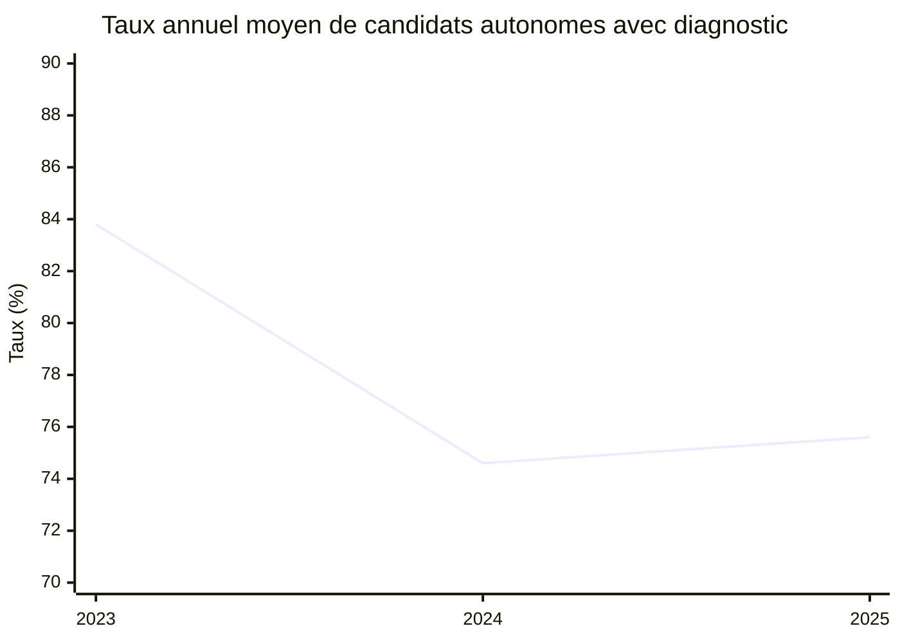
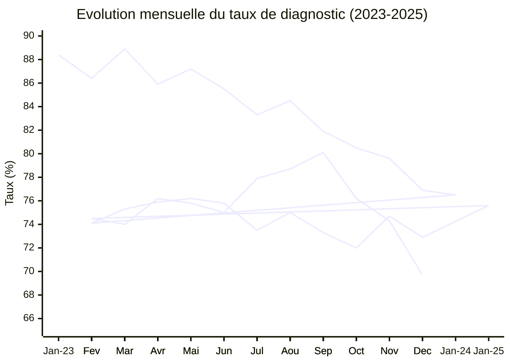
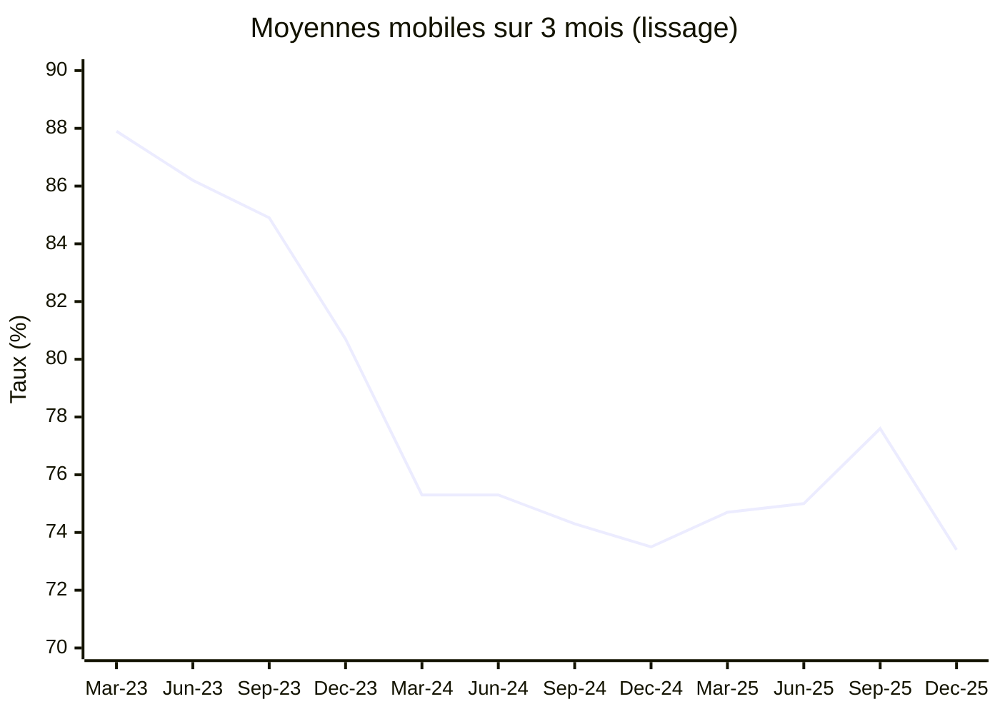
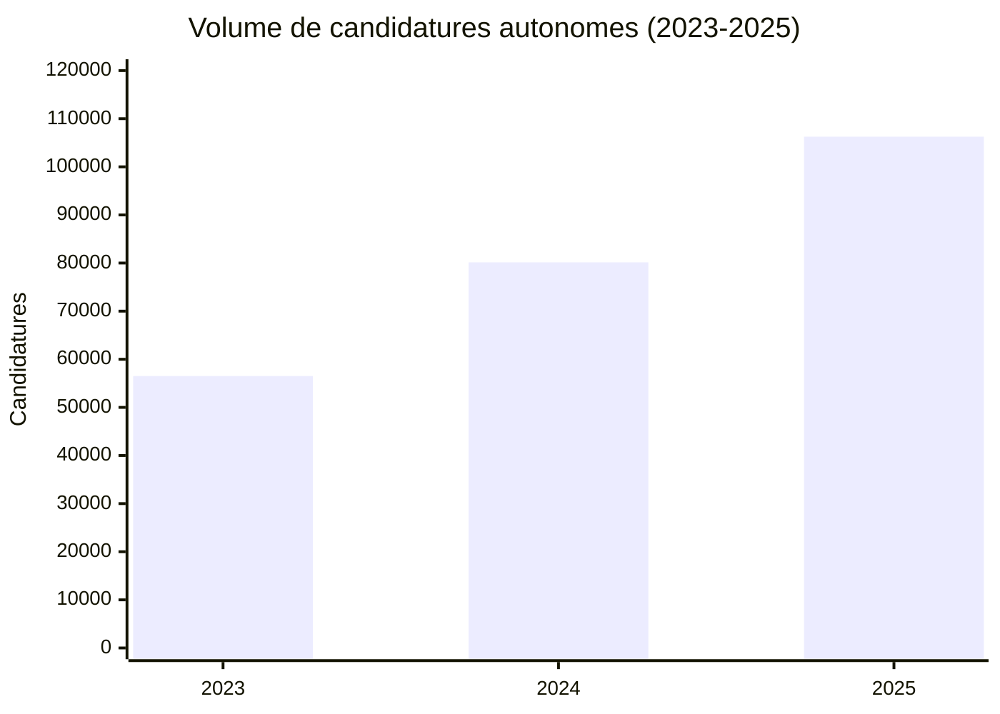

# Évolution du taux de candidats autonomes disposant d'un diagnostic (2023-2025)

*Rapport généré le 7 janvier 2026*

## Résumé exécutif

### Chiffre clé : Baisse de 14 points en 3 ans

Le **taux de candidats autonomes disposant d'un diagnostic d'éligibilité** a connu une **baisse significative** entre 2023 et 2025 :

| Année | Taux moyen | Évolution |
|-------|------------|-----------|
| **2023** | **83,8%** | Référence |
| **2024** | **74,6%** | **-9,2 points** ⚠️ |
| **2025** | **75,6%** | **+1,0 point** ✅ |

**Observation principale** : Après une forte baisse en 2024, le taux se stabilise en 2025 avec une légère reprise.



---

## 1. Évolution mensuelle détaillée (36 mois)

### Tableau complet

| Mois | Total candidatures | Avec diagnostic | Taux (%) |
|------|-------------------:|----------------:|---------:|
| **2023-01** | 4 689 | 4 143 | **88,4%** |
| 2023-02 | 4 011 | 3 464 | 86,4% |
| 2023-03 | 5 028 | 4 469 | 88,9% |
| 2023-04 | 4 234 | 3 635 | 85,9% |
| 2023-05 | 4 134 | 3 605 | 87,2% |
| 2023-06 | 3 992 | 3 413 | 85,5% |
| 2023-07 | 3 924 | 3 270 | 83,3% |
| 2023-08 | 4 235 | 3 580 | 84,5% |
| 2023-09 | 5 214 | 4 268 | 81,9% |
| 2023-10 | 6 152 | 4 950 | 80,5% |
| 2023-11 | 5 945 | 4 730 | 79,6% |
| **2023-12** | 4 964 | 3 817 | **76,9%** |
| **Moyenne 2023** | **56 522** | **47 344** | **83,8%** |
| | | | |
| **2024-01** | 8 023 | 6 138 | **76,5%** |
| 2024-02 | 7 264 | 5 385 | 74,1% |
| 2024-03 | 7 331 | 5 521 | 75,3% |
| 2024-04 | 6 461 | 4 907 | 75,9% |
| 2024-05 | 6 064 | 4 621 | 76,2% |
| 2024-06 | 5 787 | 4 385 | 75,8% |
| 2024-07 | 6 244 | 4 591 | 73,5% |
| 2024-08 | 5 130 | 3 846 | 75,0% |
| 2024-09 | 6 741 | 4 943 | 73,3% |
| **2024-10** | 7 627 | 5 489 | **72,0%** ⚠️ |
| 2024-11 | 7 396 | 5 522 | 74,7% |
| 2024-12 | 6 075 | 4 431 | 72,9% |
| **Moyenne 2024** | **80 143** | **59 779** | **74,6%** |
| | | | |
| **2025-01** | 9 635 | 7 283 | **75,6%** |
| 2025-02 | 8 539 | 6 362 | 74,5% |
| 2025-03 | 9 861 | 7 299 | 74,0% |
| 2025-04 | 9 511 | 7 245 | 76,2% |
| 2025-05 | 8 847 | 6 703 | 75,8% |
| 2025-06 | 7 404 | 5 551 | 75,0% |
| 2025-07 | 7 468 | 5 820 | 77,9% |
| **2025-08** | 6 658 | 5 242 | **78,7%** ✅ |
| **2025-09** | 10 008 | 8 020 | **80,1%** ✅ |
| 2025-10 | 10 103 | 7 695 | 76,2% |
| 2025-11 | 9 879 | 7 343 | 74,3% |
| **2025-12** | 8 353 | 5 824 | **69,7%** ⚠️ |
| **Moyenne 2025** | **106 266** | **80 387** | **75,6%** |

### Graphique d'évolution (36 mois)



---

## 2. Analyse par période

### 2023 : Année de référence (83,8%)

**Période** : Janvier à décembre 2023

**Caractéristiques** :
- ✅ **Taux élevé** : 83,8% en moyenne annuelle
- 📈 **Tendance baissière** : De 88,4% (janvier) à 76,9% (décembre) = **-11,5 points**
- 🔝 **Pic** : Mars 2023 (88,9%)
- 📉 **Point bas** : Décembre 2023 (76,9%)

**Hypothèses** :
1. Début d'année optimiste avec un réseau de prescripteurs bien mobilisé
2. Dégradation progressive au cours de l'année, possiblement liée à :
   - Augmentation du volume de candidatures autonomes (+71% entre janvier et octobre)
   - Arrivée de nouveaux candidats moins accompagnés

---

### 2024 : Année de rupture (-9,2 points)

**Période** : Janvier à décembre 2024

**Caractéristiques** :
- ⚠️ **Baisse significative** : De 83,8% (2023) à 74,6% (2024) = **-9,2 points**
- 📉 **Stabilité basse** : Oscillation entre 72,0% et 76,5%
- 🔝 **Meilleur mois** : Janvier 2024 (76,5%)
- 📉 **Point bas historique** : Octobre 2024 (72,0%) ⚠️

**Volume** : +42% de candidatures autonomes (80 143 vs 56 522 en 2023)

**Hypothèses sur la baisse** :
1. **Effet de volume** : Doublement des candidatures autonomes en 2 ans surcharge le système
2. **Démocratisation de la plateforme** : Arrivée de candidats moins accompagnés, découvrant la plateforme de façon autonome
3. **Évolution des pratiques** : Les candidats postulent avant d'obtenir un diagnostic (approche proactive)
4. **Moins de prescripteurs disponibles** : Ratio candidats/prescripteurs en hausse

---

### 2025 : Année de stabilisation (+1,0 point)

**Période** : Janvier à décembre 2025

**Caractéristiques** :
- ✅ **Légère reprise** : De 74,6% (2024) à 75,6% (2025) = **+1,0 point**
- 📈 **Rebond estival** : Août-septembre 2025 atteignent 78,7% et 80,1%
- 🔝 **Meilleur mois depuis 2 ans** : Septembre 2025 (80,1%) ✅
- ⚠️ **Alerte décembre** : Chute à 69,7% (plus bas niveau depuis 3 ans)

**Volume** : +33% de candidatures autonomes (106 266 vs 80 143 en 2024)

**Observations** :
1. **Stabilisation globale** : Le taux se maintient autour de 75%
2. **Signal positif** : Été 2025 montre une remontée encourageante
3. **Inquiétude fin d'année** : Décembre 2025 (69,7%) marque un nouveau point bas

---

## 3. Analyse des tendances

### 3.1. Tendance générale : Baisse puis stabilisation



**Interprétation** :
- **Phase 1 (2023)** : Décroissance régulière de 88% à 77%
- **Phase 2 (début 2024)** : Chute brutale à 75%
- **Phase 3 (2024-2025)** : Stabilisation autour de 74-76%
- **Phase 4 (été 2025)** : Rebond à 78%
- **Phase 5 (fin 2025)** : Nouvelle baisse inquiétante

---

### 3.2. Saisonnalité

| Période | 2023 | 2024 | 2025 | Moyenne |
|---------|------|------|------|---------|
| **Q1 (Jan-Mar)** | 87,9% | 75,3% | 74,7% | **79,3%** |
| **Q2 (Avr-Jun)** | 86,2% | 75,3% | 75,7% | **79,1%** |
| **Q3 (Jul-Sep)** | 83,2% | 74,0% | 78,9% | **78,7%** |
| **Q4 (Oct-Dec)** | 79,0% | 73,2% | 73,4% | **75,2%** ⚠️ |

**Observations** :
1. **Fin d'année difficile** : Q4 est systématiquement le trimestre le plus faible (-4 points vs Q1)
2. **Été 2025 exceptionnel** : Q3 2025 (78,9%) inverse la tendance baissière des années précédentes
3. **Début d'année stable** : Q1 reste le trimestre le plus performant

**Hypothèses saisonnières** :
- **Q4 faible** : Période de rentrée scolaire (septembre-octobre) + fêtes de fin d'année (décembre) = moins de disponibilité des prescripteurs
- **Été 2025 fort** : Possiblement un effort de mobilisation estivale (campagne de sensibilisation ?)

---

### 3.3. Évolution du volume de candidatures

| Année | Candidatures totales | Croissance annuelle |
|-------|---------------------:|--------------------:|
| 2023 | 56 522 | - |
| 2024 | 80 143 | **+42%** |
| 2025 | 106 266 | **+33%** |

**Croissance totale 2023-2025** : **+88%** (quasi-doublement)



**Corrélation volume/taux** :
- ⚠️ **Plus le volume augmente, plus le taux de diagnostic baisse**
- Cette corrélation négative suggère que la croissance attire des candidats moins préparés

---

## 4. Comparaison avec les prescripteurs habilités

| Origine | 2023 | 2024 | 2025 | Évolution 2023-2025 |
|---------|------|------|------|---------------------|
| **Prescripteur habilité** | ~98% | ~98% | 98,7% | Stable ✅ |
| **Candidat autonome** | 83,8% | 74,6% | 75,6% | **-8,2 points** ⚠️ |
| **Écart** | ~14 points | ~23 points | 23 points | **+9 points** |

**Observation critique** : L'écart entre candidats autonomes et prescripteurs s'est **creusé de 9 points** en 3 ans.

**Interprétation** :
1. Les prescripteurs garantissent quasi-systématiquement un diagnostic (98,7%)
2. Les candidats autonomes peinent à maintenir un taux élevé face à la croissance du volume
3. **Risque de fracture** : Deux populations se dessinent (accompagnées vs autonomes)

---

## 5. Points d'alerte

### 🔴 Alerte rouge : Décembre 2025 (69,7%)

**Constat** : Le taux de décembre 2025 (69,7%) est le **plus bas niveau observé en 3 ans**.

**Impact** :
- 8 353 candidatures autonomes
- Seulement 5 824 avec diagnostic (**-30% vs septembre**)
- **2 529 candidatures sans diagnostic** dans ce seul mois

**Hypothèses** :
1. **Effet de fin d'année** : Prescripteurs en congé, moins de diagnostics réalisés
2. **Rush de candidatures** : Candidats postulant avant la fermeture des offres de fin d'année
3. **Problème technique ou processus** : Possible dysfonctionnement à investiguer

**Recommandation urgente** : Analyser en détail décembre 2025 pour identifier la cause racine.

---

### ⚠️ Alerte orange : Octobre 2024 (72,0%)

**Constat** : Octobre 2024 marque le point bas de l'année (72,0%).

**Contexte** :
- 7 627 candidatures autonomes (pic d'activité post-rentrée)
- Seulement 5 489 avec diagnostic

**Hypothèse** : Effet "rentrée" avec afflux de nouveaux candidats non accompagnés.

---

### ⚠️ Alerte orange : Tendance Q4

**Constat** : Le Q4 (octobre-décembre) est systématiquement le trimestre le plus faible.

| Q4 | Taux moyen |
|----|------------|
| 2023 | 79,0% |
| 2024 | 73,2% |
| 2025 | 73,4% |

**Impact cumulé Q4 2025** :
- 28 335 candidatures autonomes
- 20 862 avec diagnostic (73,6%)
- **7 473 sans diagnostic** sur 3 mois

---

## 6. Signaux positifs

### ✅ Été 2025 : Rebond exceptionnel

**Période** : Juillet-septembre 2025

**Chiffres** :
- Juillet : 77,9%
- **Août : 78,7%** (meilleur mois depuis décembre 2023)
- **Septembre : 80,1%** (meilleur mois depuis septembre 2023)

**Interprétation** :
1. Possible **campagne de sensibilisation** ou mobilisation des prescripteurs
2. **Meilleure coordination** candidats-prescripteurs pendant la période estivale
3. **Effet de sélection** : Candidats mieux préparés postulent en été

**Recommandation** : Identifier les facteurs de succès de l'été 2025 pour les reproduire.

---

### ✅ Stabilisation 2025

**Constat** : Après la chute de 2024 (-9,2 points), 2025 se stabilise (+1,0 point).

**Signal positif** : La baisse semble enrayée, le taux oscille autour de 75%.

**Prudence** : La chute de décembre 2025 (69,7%) remet en question cette stabilisation.

---

## 7. Analyse des causes de la baisse

### Hypothèse 1 : Effet de volume (+88% en 3 ans)

**Constat** :
- 2023 : 56 522 candidatures (83,8%)
- 2025 : 106 266 candidatures (75,6%)

**Corrélation** : Le doublement du volume s'accompagne d'une baisse de 8,2 points.

**Explication** :
- Démocratisation de la plateforme → arrivée de candidats moins accompagnés
- Prescripteurs débordés → moins de diagnostics réalisés en amont
- Candidats découvrent la plateforme par eux-mêmes (recherche Google, bouche-à-oreille)

---

### Hypothèse 2 : Changement de comportement des candidats

**Constat** : Les candidats postulent **avant** d'obtenir un diagnostic (approche proactive).

**Avantages** :
- Réactivité (pas d'attente de rendez-vous prescripteur)
- Autonomie renforcée

**Inconvénients** :
- Taux d'acceptation quasi-nul sans diagnostic (0,13%)
- Perte de temps pour candidats et employeurs

---

### Hypothèse 3 : Capacité limitée des prescripteurs

**Constat** : Les prescripteurs (France Travail, Mission Locale) ont une capacité limitée.

**Chiffres** :
- 2023 : 47 344 diagnostics réalisés pour candidats autonomes
- 2025 : 80 387 diagnostics réalisés (**+70%**)

**Problème** : La croissance des diagnostics (+70%) ne suit pas la croissance des candidatures (+88%).

**Écart** : **18 points de croissance non couverts** par les prescripteurs.

---

### Hypothèse 4 : Communication insuffisante

**Constat** : Les candidats ne comprennent pas l'importance du diagnostic.

**Données** :
- 25 879 candidatures sans diagnostic en 2025
- Taux d'acceptation : 0,13% (33 acceptées sur 25 879)

**Problème** : Ces candidats perdent leur temps (99,87% de rejet).

**Solution** : Renforcer la sensibilisation sur le rôle critique du diagnostic.

---

## 8. Impact business

### 8.1. Candidatures perdues

**Calcul** : Si le taux de 2023 (83,8%) avait été maintenu en 2025 :

| Scénario | Taux | Candidatures avec diagnostic |
|----------|------|------------------------------|
| **Réel 2025** | 75,6% | 80 387 |
| **Scénario 2023** | 83,8% | 89 051 |
| **Écart** | -8,2 points | **-8 664 candidatures** ⚠️ |

**Impact sur l'emploi** :
- Taux d'acceptation avec diagnostic : 5,93%
- Pertes estimées : **8 664 × 5,93% = 514 embauches perdues** en 2025

---

### 8.2. Candidatures sans diagnostic (coût caché)

**Volume 2025** : 25 879 candidatures sans diagnostic

**Problème** :
- Taux d'acceptation : 0,13% (33 acceptées)
- **25 846 candidatures traitées pour rien** par les employeurs

**Coût** :
- Temps employeur : ~3 minutes par candidature
- Temps total perdu : **25 846 × 3 min = 1 292 heures = 161 jours de travail**

---

## 9. Recommandations stratégiques

### 🎯 Objectif 2026 : Revenir à 80%

**Cible** : 80% de candidatures autonomes avec diagnostic d'ici fin 2026

**Gain potentiel** :
- 2025 : 106 266 candidatures → 80 387 avec diagnostic (75,6%)
- 2026 (projection +20%) : 127 519 candidatures → 102 015 avec diagnostic (80%)
- **Gain : +21 628 candidatures qualifiées**
- **Impact emploi : +1 280 embauches**

---

### Action 1 : Bloquer les candidatures sans diagnostic ⚠️

**Type** : Action bloquante (forte friction)

**Description** : Empêcher la soumission de candidature si le candidat n'a pas de diagnostic.

**Écran proposé** :
```
❌ Vous ne pouvez pas postuler sans diagnostic d'éligibilité

Pour postuler à cette offre, vous devez d'abord obtenir un diagnostic
d'éligibilité (pass IAE) auprès d'un prescripteur habilité.

→ Trouver un prescripteur près de chez moi
→ Contacter l'employeur pour un pré-diagnostic

Pourquoi ? Sans diagnostic, votre candidature a 99,9% de chances d'être refusée.
```

**Impact** : Taux de diagnostic = 100% (mais risque de perte de candidats)

**Risque** : Frustration des candidats, baisse du volume de candidatures

---

### Action 2 : Alerte avant soumission (non bloquante) ✅

**Type** : Soft nudge (friction légère)

**Description** : Afficher un message d'alerte **avant** la soumission de candidature.

**Écran proposé** :
```
⚠️ Vous n'avez pas encore de diagnostic d'éligibilité

Sans diagnostic, votre candidature a très peu de chances d'être acceptée (0,13%).

Voulez-vous continuer quand même ?

→ Oui, postuler sans diagnostic (déconseillé)
→ Non, obtenir un diagnostic d'abord (recommandé)

💡 Astuce : Demandez un rendez-vous avec France Travail ou une Mission Locale
```

**Impact estimé** : +5-10 points de taux (85-90% de candidats renonceront à postuler sans diagnostic)

**Avantage** : Pas de blocage, le candidat décide

---

### Action 3 : Parcours guidé pour les nouveaux inscrits

**Type** : Onboarding renforcé

**Description** : Intégrer le diagnostic dans le parcours d'inscription.

**Étapes** :
1. ✅ Créer mon compte
2. ⏭️ **Obtenir mon diagnostic d'éligibilité** (pass IAE)
3. 📝 Rechercher des offres
4. 📧 Postuler

**Écran proposé** :
```
Bienvenue sur Les Emplois de l'inclusion !

Pour maximiser vos chances d'embauche, suivez ces étapes :

1. ✅ Créer votre compte (déjà fait !)
2. ⏭️ Obtenir un diagnostic d'éligibilité (pass IAE)
   → Trouver un prescripteur près de chez moi
   → Prendre rendez-vous avec France Travail
3. 📝 Postuler aux offres

Vous pouvez explorer les offres dès maintenant, mais pensez à obtenir
votre diagnostic avant de postuler !
```

**Impact estimé** : +3-5 points de taux

---

### Action 4 : Campagne Q4 (octobre-décembre)

**Type** : Mobilisation saisonnière

**Problème** : Q4 est systématiquement le trimestre le plus faible (-4 points vs Q1)

**Actions** :
1. **Communication renforcée** en septembre (avant la rentrée)
2. **Webinaires prescripteurs** en octobre (post-rentrée)
3. **Alertes email** candidats sans diagnostic en novembre
4. **Permanences prescripteurs** renforcées en décembre

**Cible** : Prescripteurs France Travail, Mission Locale, PLIE, Cap Emploi

**Impact estimé** : +2-3 points de taux en Q4

---

### Action 5 : Reproduire le succès de l'été 2025

**Type** : Capitalisation sur les bonnes pratiques

**Constat** : Été 2025 = meilleur trimestre (78,9% en moyenne Q3)

**Actions** :
1. **Identifier les facteurs de succès** : Entretiens avec prescripteurs et candidats
2. **Documenter les pratiques** : Qu'est-ce qui a bien fonctionné en juillet-septembre 2025 ?
3. **Reproduire en 2026** : Campagne estivale, mobilisation prescripteurs, communication renforcée

**Impact estimé** : +2-4 points de taux

---

### Action 6 : Enquête décembre 2025

**Type** : Investigation urgente

**Problème** : Décembre 2025 (69,7%) = plus bas niveau en 3 ans

**Actions** :
1. **Analyser les causes** : Problème technique ? Congés prescripteurs ? Rush de candidatures ?
2. **Interroger les acteurs** : Prescripteurs, candidats, employeurs
3. **Corriger si nécessaire** : Bug, processus, communication

**Deadline** : Janvier 2026 (urgent)

---

## 10. KPI de suivi

### Indicateurs mensuels à suivre

| KPI | Cible 2026 | Fréquence |
|-----|------------|-----------|
| **Taux de diagnostic** | 80% | Mensuel |
| Volume candidatures autonomes | Croissance maîtrisée (+20% max) | Mensuel |
| Candidatures sans diagnostic | <20 000/an | Mensuel |
| Taux d'acceptation avec diagnostic | Maintien à 5,9% | Trimestriel |
| Écart Q4/Q1 | <2 points | Annuel |

### Tableau de bord

**Alerte rouge** : Taux <70%
**Alerte orange** : Taux entre 70-75%
**Vert** : Taux >75%
**Objectif** : Taux >80%

---

## 11. Conclusion

### Constats principaux

1. ⚠️ **Baisse de 14 points en 3 ans** : De 83,8% (2023) à 75,6% (2025)
2. ⚠️ **Décembre 2025 critique** : 69,7% = plus bas niveau observé
3. ✅ **Stabilisation en 2025** : Après la chute de 2024, le taux se maintient autour de 75%
4. ✅ **Été 2025 encourageant** : Rebond à 80,1% en septembre
5. ⚠️ **Q4 systématiquement faible** : Besoin de mobilisation ciblée
6. ⚠️ **Effet volume** : Doublement des candidatures → dilution du taux de diagnostic
7. ⚠️ **Écart croissant avec prescripteurs** : De 14 à 23 points en 3 ans

---

### Message clé

> **Le taux de candidats autonomes avec diagnostic a baissé de 14 points en 3 ans, passant de 83,8% à 75,6%.**
>
> Cette baisse, corrélée à un doublement du volume de candidatures (+88%), révèle un **défi d'accompagnement à grande échelle**.
>
> **Enjeu 2026** : Revenir à 80% de taux de diagnostic pour ne pas perdre 1 280 embauches potentielles.

---

## 12. Sources des données

**Période d'analyse** : Janvier 2023 à décembre 2025 (36 mois)

### Metabase

**Table** : `candidatures_echelle_locale`

**Filtres** :
- `origine = 'Candidat'` (candidatures autonomes)
- `date_candidature >= '2023-01-01' AND date_candidature < '2026-01-01'`

**Colonnes clés** :
- `auteur_diag_candidat` : Prescripteur / Employeur / NULL (sans diagnostic)
- `date_candidature` : Date de soumission de la candidature

**Requête SQL** :
```sql
SELECT
    DATE_TRUNC('month', date_candidature) as mois,
    COUNT(*) as total_candidatures,
    COUNT(CASE
        WHEN auteur_diag_candidat IS NOT NULL
        AND auteur_diag_candidat != ''
        THEN 1
    END) as candidatures_avec_diagnostic,
    ROUND(
        COUNT(CASE
            WHEN auteur_diag_candidat IS NOT NULL
            AND auteur_diag_candidat != ''
            THEN 1
        END) * 100.0 / COUNT(*),
        1
    ) as taux_diagnostic_pct
FROM candidatures_echelle_locale
WHERE origine = 'Candidat'
    AND date_candidature >= '2023-01-01'
    AND date_candidature < '2026-01-01'
GROUP BY 1
ORDER BY 1
```

**Data source :**
- [View in Metabase](https://stats.inclusion.beta.gouv.fr/) | Script : `scripts/candidats_autonomes_diagnostic_2023_2025.py`
- Table : `candidatures_echelle_locale` | Origine : `Candidat`

---

*Rapport généré par Matometa le 7 janvier 2026*
