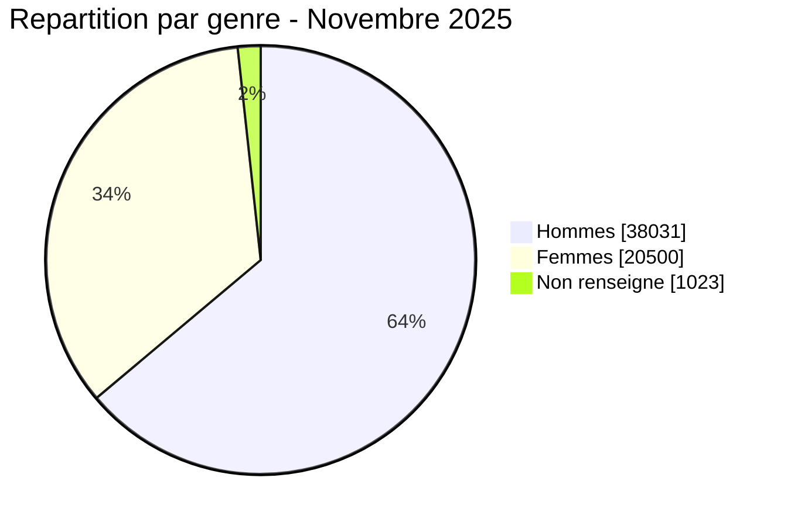
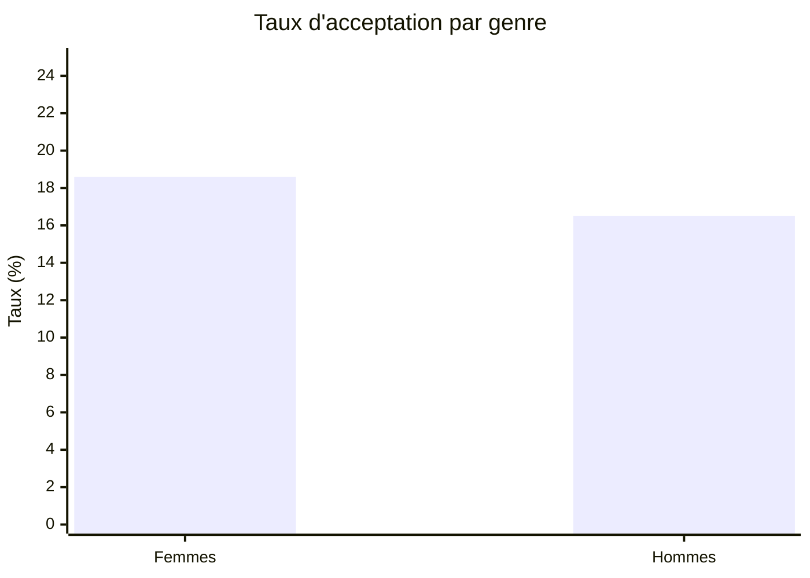

# Répartition hommes/femmes dans les candidatures IAE - Novembre 2025

*Rapport généré le 5 janvier 2026*

## Résumé exécutif

En novembre 2025, les candidatures IAE restent très majoritairement masculines, avec un ratio d'environ **65/35** (hommes/femmes). Cependant, les femmes affichent un **taux d'acceptation supérieur** (+2,1 points).

### Chiffres clés

| Indicateur | Hommes | Femmes | Écart |
|------------|--------|--------|-------|
| Candidatures | 38 031 (65,0 %) | 20 500 (35,0 %) | +17 531 |
| Candidats uniques | 22 811 | 14 177 | +8 634 |
| Candidatures acceptées | 6 259 | 3 811 | +2 448 |
| **Taux d'acceptation** | **16,5 %** | **18,6 %** | **-2,1 pts** |

---

## 1. Volume global des candidatures

| Genre | Candidatures | % du total | Candidats uniques |
|-------|--------------|------------|-------------------|
| Homme | 38 031 | 63,9 % | 22 811 |
| Femme | 20 500 | 34,4 % | 14 177 |
| Non renseigné | 1 023 | 1,7 % | 576 |
| **Total** | **59 554** | **100 %** | **37 564** |

**Observation** : Un homme fait en moyenne 1,67 candidature contre 1,45 pour une femme.

**Data source:** [Dashboard Femmes IAE](https://metabase.inclusion.beta.gouv.fr/dashboard/216) | `SELECT genre_candidat, COUNT(*) FROM candidatures_echelle_locale WHERE date_candidature >= '2025-11-01' AND date_candidature < '2025-12-01' GROUP BY genre_candidat`

---

## 2. Candidatures acceptées

| Genre | Candidatures acceptées | Candidats acceptés | Taux d'acceptation |
|-------|------------------------|--------------------|--------------------|
| Homme | 6 259 | 6 194 | 16,5 % |
| Femme | 3 811 | 3 774 | 18,6 % |
| Non renseigné | 104 | 104 | 10,2 % |

**Constat clé** : Les femmes ont un taux d'acceptation supérieur de **2,1 points** à celui des hommes.

---

## 3. Répartition par type de SIAE

Les différences de répartition par type de structure sont notables :

### Femmes

| Type SIAE | Candidatures | % |
|-----------|--------------|---|
| ACI | 8 415 | 41,0 % |
| AI | 5 943 | 29,0 % |
| EI | 3 344 | 16,3 % |
| ETTI | 1 855 | 9,0 % |
| Autres | 943 | 4,7 % |

### Hommes

| Type SIAE | Candidatures | % |
|-----------|--------------|---|
| ACI | 15 252 | 40,1 % |
| ETTI | 8 283 | 21,8 % |
| EI | 7 346 | 19,3 % |
| AI | 5 225 | 13,7 % |
| Autres | 1 925 | 5,1 % |

**Différences majeures** :
- **AI (Associations Intermédiaires)** : 29,0 % des candidatures femmes vs 13,7 % hommes (+15,3 pts)
- **ETTI (Travail temporaire)** : 21,8 % des candidatures hommes vs 9,0 % femmes (+12,8 pts)

Cette différence reflète la ségrégation sectorielle : les AI sont souvent dans les services à la personne (majoritairement féminins), tandis que les ETTI couvrent davantage le BTP et l'industrie (majoritairement masculins).

---

## 4. Taux d'acceptation par type de SIAE

| Type SIAE | Taux Femmes | Taux Hommes | Écart |
|-----------|-------------|-------------|-------|
| EITI | 56,5 % | 40,9 % | +15,6 pts |
| AI | 27,9 % | 22,9 % | +5,0 pts |
| ETTI | 24,6 % | 24,2 % | +0,4 pts |
| ACI | 13,9 % | 13,6 % | +0,3 pts |
| EI | 12,1 % | 11,4 % | +0,7 pts |
| GEIQ | 3,8 % | 6,7 % | -2,9 pts |

**Observation** : Les femmes ont un taux d'acceptation supérieur dans presque tous les types de structure, sauf les GEIQ.

---

## 5. Répartition par origine de candidature

| Origine | Femmes | % | Hommes | % |
|---------|--------|---|--------|---|
| Prescripteur habilité | 14 598 | 71,2 % | 27 241 | 71,6 % |
| Candidat (autonome) | 3 488 | 17,0 % | 6 264 | 16,5 % |
| Employeur | 1 443 | 7,0 % | 2 524 | 6,6 % |
| Orienteur | 747 | 3,6 % | 1 492 | 3,9 % |
| Employeur orienteur | 224 | 1,1 % | 510 | 1,3 % |

La répartition par origine est quasi-identique entre hommes et femmes. La majorité des candidatures (>71 %) passent par un prescripteur habilité.

---

## 6. Répartition par tranche d'âge

| Tranche d'âge | Femmes | % | Hommes | % | Écart |
|---------------|--------|---|--------|---|-------|
| Jeune (< 26 ans) | 3 362 | 16,4 % | 8 683 | 22,8 % | -6,4 pts |
| Adulte (26-54 ans) | 14 334 | 69,9 % | 23 854 | 62,7 % | +7,2 pts |
| Senior (55 ans et +) | 2 804 | 13,7 % | 5 494 | 14,4 % | -0,7 pts |

**Constat** : Les femmes candidates sont proportionnellement plus nombreuses dans la tranche 26-54 ans. Les jeunes hommes (< 26 ans) sont surreprésentés.

---

## 7. Évolution (comparaison octobre/novembre 2025)

| Mois | Part Femmes | Part Hommes |
|------|-------------|-------------|
| Octobre 2025 | 34,7 % | 65,3 % |
| Novembre 2025 | 35,0 % | 65,0 % |
| **Évolution** | **+0,3 pts** | **-0,3 pts** |

La part des femmes dans les candidatures progresse très légèrement (+0,3 point).

---

## Synthèse

### Points clés

1. **Déséquilibre structurel** : 65 % d'hommes, 35 % de femmes dans les candidatures IAE
2. **Meilleur taux d'acceptation des femmes** : 18,6 % vs 16,5 % (+2,1 pts)
3. **Ségrégation sectorielle** : Les femmes candidatent davantage dans les AI (services à la personne), les hommes dans les ETTI (intérim industriel/BTP)
4. **Profil d'âge différent** : Plus de jeunes hommes (<26 ans), plus de femmes dans la tranche centrale (26-54 ans)

### Pistes d'analyse

- Le meilleur taux d'acceptation des femmes est-il lié aux secteurs (AI plus accueillants) ou à d'autres facteurs ?
- La sous-représentation des femmes reflète-t-elle celle du marché du travail précaire masculin ou un déficit d'orientation vers l'IAE ?

---

*Rapport basé sur les données Metabase, table `candidatures_echelle_locale`, période du 1er au 30 novembre 2025.*
