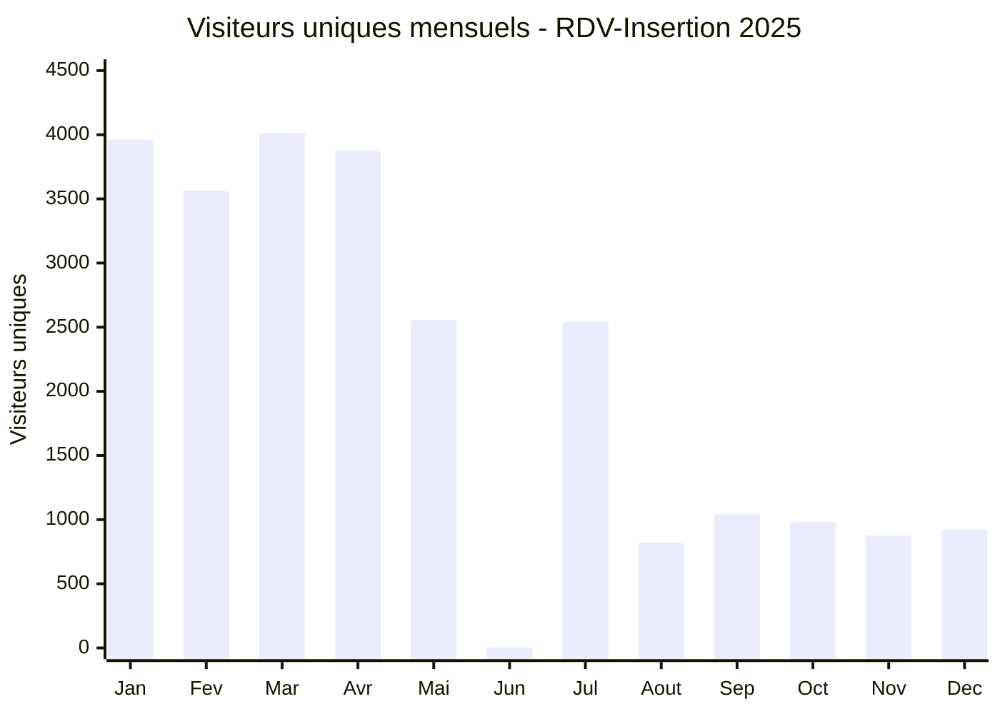
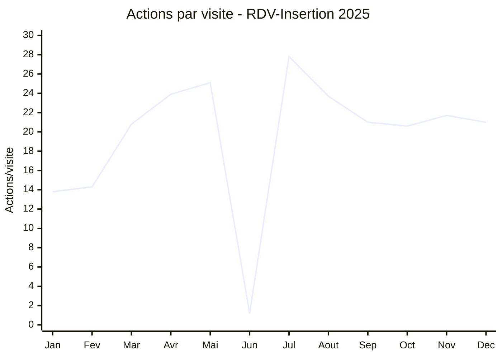

# RDV-Insertion : Meilleur mois de 2025

## Synthèse

**Mars 2025** a été le meilleur mois de RDV-Insertion en termes de trafic (visiteurs et visites), avec **avril 2025** en seconde position très proche. Cependant, avril a généré le plus d'événements et la meilleure qualité d'engagement.

### Classement par métrique

**Par visiteurs uniques :**
1. Mars 2025 : 4 013 visiteurs uniques
2. Avril 2025 : 3 874 visiteurs uniques (-3,5%)
3. Janvier 2025 : 3 962 visiteurs uniques

**Par visites totales :**
1. Mars 2025 : 15 739 visites
2. Avril 2025 : 14 954 visites (-5,0%)
3. Janvier 2025 : 14 648 visites

**Par actions/visite (engagement) :**
1. **Juillet 2025 : 27,8 actions/visite**
2. Mai 2025 : 25,1 actions/visite
3. **Avril 2025 : 23,9 actions/visite**
4. Août-Décembre : ~20-24 actions/visite
5. Mars 2025 : 20,8 actions/visite

## Données de trafic mensuelles (2025)

| Mois       | Visiteurs uniques | Visites  | Visites/jour | Actions/visite | Temps moyen | Taux rebond |
|------------|------------------:|----------|--------------:|---------------:|-------------|-------------|
| Janvier    |             3 962 |   14 648 |           473 |           13,8 |      12m09s |         27% |
| Février    |             3 563 |   13 617 |           486 |           14,3 |      12m58s |         26% |
| **Mars**   |         **4 013** | **15 739** |       **508** |       **20,8** |  **13m28s** |     **23%** |
| Avril      |             3 874 |   14 954 |           498 |           23,9 |      14m07s |         22% |
| Mai        |             2 556 |    8 851 |           286 |           25,1 |      13m31s |         23% |
| Juin       |                 4 |        5 |             0 |            1,2 |          1s |         80% |
| Juillet    |             2 542 |   11 264 |           363 |           27,8 |      14m18s |         19% |
| Août       |               820 |    6 499 |           210 |           23,7 |      15m46s |          5% |
| Septembre  |             1 043 |    8 738 |           291 |           21,0 |      15m03s |          5% |
| Octobre    |               980 |    8 979 |           290 |           20,6 |      15m10s |          5% |
| Novembre   |               877 |    8 091 |           270 |           21,7 |      15m52s |          4% |
| Décembre   |               923 |    7 784 |           251 |           21,0 |      15m10s |          5% |

**Data source:** [View in Matomo](https://matomo.inclusion.beta.gouv.fr/index.php?module=CoreHome&action=index&idSite=214&period=month&date=2025-01-01,2025-12-31#?idSite=214&period=month&date=2025-01-01,2025-12-31&category=General_Visitors&subcategory=VisitsSummary_VisitsSummary) | `VisitsSummary.get?idSite=214&period=month&date=2025-01-01,2025-12-31`

## Pourquoi mars 2025 était exceptionnel ?

### 1. Explosion des imports de fichiers

Mars 2025 a connu une explosion massive de l'utilisation de la fonctionnalité d'import de fichiers CSV :

| Mois       | Total événements | Événements "Upload" | Part des uploads |
|------------|------------------:|--------------------:|-----------------:|
| Janvier    |             2 717 |                 561 |            20,6% |
| Février    |             1 484 |                 503 |            33,9% |
| **Mars**   |       **108 278** |          **83 189** |        **76,8%** |
| Avril      |           126 133 |              87 647 |            69,5% |
| Mai        |            88 594 |              47 706 |            53,8% |

L'événement `Chargement du fichier` (catégorie: Upload) est passé de 500-600 événements/mois à **83 189 événements en mars**, représentant 77% de toute l'activité mesurée.

**Visites liées aux uploads :** 9 489 visites en mars (60% des visites totales du mois)

### 2. Forte activité sur les actions de gestion des usagers

Les actions principales en mars 2025 :

| Action                      | Événements | Visites | Description                    |
|-----------------------------|------------:|--------:|--------------------------------|
| Chargement du fichier       |     83 189 |   9 489 | Import de fichiers CSV         |
| confirm-button              |      6 073 |   3 102 | Confirmations d'actions        |
| archive-button              |      4 759 |   2 740 | Archivage d'usagers            |
| toggle-rdv-status           |      6 168 |   2 409 | Changement de statut de RDV    |
| btn-organisation-navigation |      4 015 |   2 297 | Navigation entre organisations |
| dropdownMenuLink            |      1 842 |     858 | Menus déroulants               |
| batch-actions-button        |        684 |     205 | Actions groupées               |
| csvExportButton             |        304 |     200 | Export CSV                     |

**Data source:** [View in Matomo](https://matomo.inclusion.beta.gouv.fr/index.php?module=CoreHome&action=index&idSite=214&period=month&date=2025-03-01#?idSite=214&period=month&date=2025-03-01&category=General_Actions&subcategory=Events_Events) | `Events.getAction?idSite=214&period=month&date=2025-03-01`

### 3. Organisations les plus actives

Les organisations et départements ayant généré le plus d'événements en mars 2025 :

| Organisation/Département            | Événements | Visites |
|-------------------------------------|------------:|--------:|
| **Upload** (système)                |     83 189 |   9 489 |
| /departments/40/users (Landes)      |        327 |     180 |
| /organisations/571/users            |        227 |     134 |
| /organisations/572/users            |        185 |     114 |
| /organisations/549/users            |        163 |      89 |
| /departments/75/users (Paris)       |        307 |      70 |
| /departments/44/users (Loire-Atlantique) |   191 |      41 |

**Data source:** [View in Matomo](https://matomo.inclusion.beta.gouv.fr/index.php?module=CoreHome&action=index&idSite=214&period=month&date=2025-03-01#?idSite=214&period=month&date=2025-03-01&category=General_Actions&subcategory=Events_Events) | `Events.getCategory?idSite=214&period=month&date=2025-03-01`

## Analyse : Anomalie de juin 2025

**Juin 2025 montre un effondrement complet du trafic** : seulement 4 visiteurs uniques et 5 visites pour le mois entier, avec un taux de rebond de 80%. Cette anomalie suggère :

- Un incident technique majeur (site inaccessible ou dysfonctionnel)
- Une migration ou mise à jour problématique
- Une coupure du service

Le trafic se rétablit progressivement à partir de juillet, mais reste significativement inférieur aux niveaux de janvier-mai.

## Évolution du trafic sur l'année

## Conclusion

**Mars 2025** est le meilleur mois en termes de volume de trafic (visiteurs et visites), marqué par :

1. **Campagne massive d'import de données** : multiplication par 150x des événements d'upload par rapport à janvier-février
2. **Forte activité de gestion** : archivage, confirmations, changements de statut
3. **Engagement géographique large** : multiples départements actifs (40, 75, 44, 28, 15, etc.)

Cependant, **avril 2025** montre le meilleur équilibre entre volume et qualité d'engagement (23,9 actions/visite), tandis que **juillet 2025** atteint le pic d'engagement (27,8 actions/visite) malgré un volume plus faible.

L'effondrement de juin reste inexpliqué et nécessiterait une investigation technique pour comprendre la cause (incident, migration, maintenance prolongée).

## Recommandations

1. **Investiguer l'incident de juin 2025** pour éviter sa répétition
2. **Analyser les causes de la baisse post-juin** : le trafic ne retrouve pas ses niveaux de janvier-mai
3. **Capitaliser sur les pics d'import** : comprendre ce qui a motivé l'usage massif en mars-avril pour reproduire ces conditions
4. **Améliorer la rétention** : le taux de rebond s'améliore considérablement après juin (5% vs 23-27%), identifier les changements responsables
