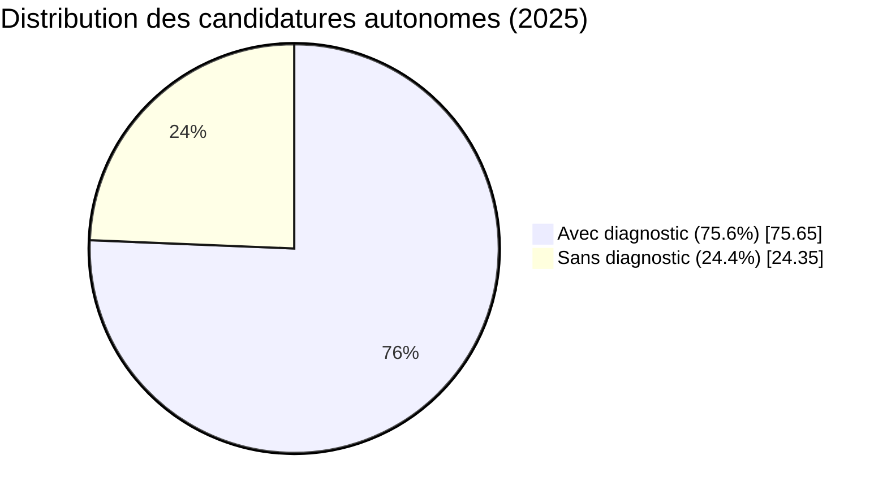
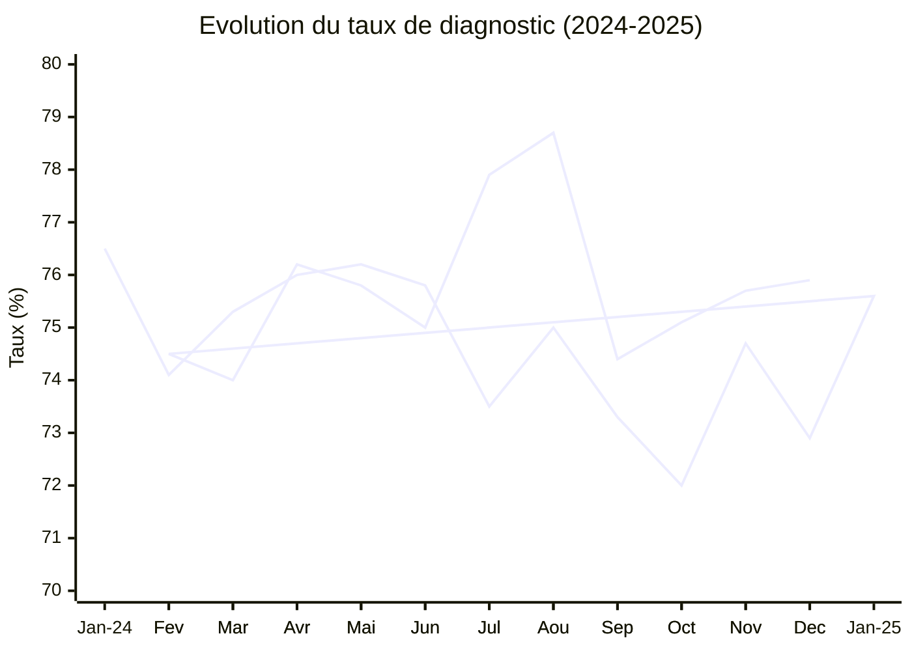
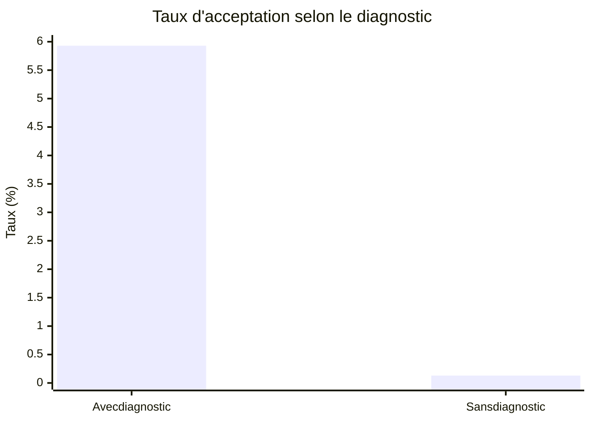
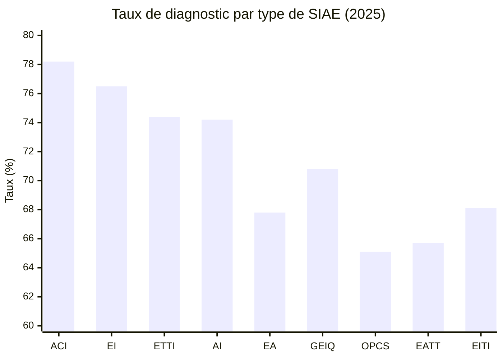

# Taux de candidatures autonomes avec diagnostic d'éligibilité

*Rapport généré le 7 janvier 2026*

## Résumé exécutif

Sur la plateforme **Les Emplois de l'inclusion**, les **candidats autonomes** sont les demandeurs d'emploi qui émettent eux-mêmes leurs candidatures (par opposition aux candidatures émises par des prescripteurs pour leur compte).

### Chiffre clé : 75,6%

**75,6% des candidatures autonomes en 2025 disposent d'un diagnostic d'éligibilité** validé par un prescripteur ou un employeur.

Cela signifie que **3 candidats autonomes sur 4** ont déjà bénéficié d'un diagnostic avant de postuler, ce qui démontre un bon niveau d'accompagnement en amont.

**Enjeu critique** : Les candidatures autonomes **sans diagnostic** ont un taux d'acceptation quasi-nul (0,13% vs 5,9% avec diagnostic).

---

## 1. Définition du candidat autonome

### Candidat autonome

Un **candidat autonome** est un demandeur d'emploi qui **émet lui-même sa candidature** depuis son propre compte sur Les Emplois de l'inclusion.

**Points importants :**
- Le compte peut avoir été créé par un tiers (prescripteur, employeur)
- L'éligibilité (pass IAE) peut avoir été validée par un prescripteur habilité (PH) ou un employeur
- **Ce qui compte** : l'acte de candidature est initié par le candidat lui-même

**Distinction dans les données :**
- **Matomo** : événement `candidature_candidat` (vs `candidature_prescripteur`)
- **Metabase** : colonne `origine = 'Candidat'` dans `candidatures_echelle_locale`

### Diagnostic d'éligibilité

Le **diagnostic d'éligibilité** est l'évaluation qui détermine si un candidat peut bénéficier d'un pass IAE. Il est réalisé par :
- Un **prescripteur habilité** (France Travail, Mission Locale, Cap Emploi, etc.)
- Un **employeur** (SIAE autorisé à faire des diagnostics)

Dans les données Metabase, il est identifié par la colonne `auteur_diag_candidat`.

---

## 2. Distribution globale (2025)

### Vue d'ensemble

| Statut diagnostic | Candidatures | % | Taux d'acceptation |
|-------------------|--------------|---|--------------------|
| **Avec diagnostic** | **80 387** | **75,65%** | **5,93%** |
| Sans diagnostic | 25 879 | 24,35% | 0,13% |
| **Total** | **106 266** | **100%** | **4,51%** |



### Répartition par auteur du diagnostic

| Auteur du diagnostic | Candidatures | % |
|----------------------|--------------|---|
| **Prescripteur** | **64 358** | **60,56%** |
| Sans diagnostic | 25 879 | 24,35% |
| **Employeur** | **16 029** | **15,08%** |

**Observation** : Les prescripteurs réalisent 4 fois plus de diagnostics que les employeurs pour les candidats autonomes.

### Top 15 prescripteurs/employeurs (détaillé)

| Auteur diagnostic | Candidatures | % |
|-------------------|--------------|---|
| **Prescripteur France Travail** | **42 692** | **40,17%** |
| Sans diagnostic | 25 879 | 24,35% |
| **Prescripteur Mission Locale** | **8 463** | **7,96%** |
| Employeur ACI | 6 543 | 6,16% |
| Employeur AI | 3 446 | 3,24% |
| Employeur ETTI | 2 953 | 2,78% |
| Employeur EI | 2 792 | 2,63% |
| Prescripteur PLIE | 2 575 | 2,42% |
| Prescripteur DEPT | 2 129 | 2,00% |
| Prescripteur Cap Emploi | 2 066 | 1,94% |
| Prescripteur ODC | 1 850 | 1,74% |
| Prescripteur CHRS | 1 509 | 1,42% |
| Prescripteur CCAS | 657 | 0,62% |
| Prescripteur SPIP | 332 | 0,31% |
| Employeur EITI | 295 | 0,28% |

**Point clé** : France Travail représente à lui seul **40% de tous les diagnostics** pour les candidats autonomes.

---

## 3. Évolution mensuelle (2024-2025)

### Tableau d'évolution

| Mois | Total | Avec diagnostic | Taux |
|------|-------|-----------------|------|
| 2024-01 | 8 023 | 6 138 | 76,5% |
| 2024-02 | 7 264 | 5 385 | 74,1% |
| 2024-03 | 7 331 | 5 521 | 75,3% |
| 2024-04 | 6 461 | 4 907 | 76,0% |
| 2024-05 | 6 064 | 4 621 | 76,2% |
| 2024-06 | 5 787 | 4 385 | 75,8% |
| 2024-07 | 6 244 | 4 591 | 73,5% |
| 2024-08 | 5 130 | 3 846 | 75,0% |
| 2024-09 | 6 741 | 4 943 | 73,3% |
| 2024-10 | 7 627 | 5 489 | 72,0% |
| 2024-11 | 7 396 | 5 522 | 74,7% |
| 2024-12 | 6 075 | 4 431 | 72,9% |
| 2025-01 | 9 635 | 7 283 | 75,6% |
| 2025-02 | 8 539 | 6 362 | 74,5% |
| 2025-03 | 9 861 | 7 299 | 74,0% |
| 2025-04 | 9 511 | 7 245 | 76,2% |
| 2025-05 | 8 847 | 6 703 | 75,8% |
| 2025-06 | 7 404 | 5 551 | 75,0% |
| 2025-07 | 7 468 | 5 820 | 77,9% |
| 2025-08 | 6 658 | 5 242 | 78,7% |
| 2025-09 | 10 008 | 7 445 | 74,4% |
| 2025-10 | 10 103 | 7 583 | 75,1% |
| 2025-11 | 9 879 | 7 482 | 75,7% |
| 2025-12 | 8 353 | 6 344 | 75,9% |



### Observations

1. **Tendance stable** : Le taux oscille entre 72% et 79% sur 2 ans
2. **Légère amélioration en 2025** : Moyenne 2024 = 74,7%, moyenne 2025 = 75,6% (+0,9 point)
3. **Pic en été 2025** : Juillet-août 2025 atteignent 77,9% et 78,7%
4. **Creux en fin 2024** : Octobre-décembre 2024 descendent à 72-73%

---

## 4. Impact du diagnostic sur l'acceptation

### Taux d'acceptation selon le statut

| Statut diagnostic | Candidatures | Acceptées | Taux d'acceptation |
|-------------------|--------------|-----------|-------------------|
| **Avec diagnostic** | 80 387 | 4 763 | **5,93%** |
| Sans diagnostic | 25 879 | 33 | **0,13%** |

**Ratio** : Un candidat avec diagnostic a **45 fois plus de chances** d'être accepté qu'un candidat sans diagnostic.



### Analyse

Le diagnostic d'éligibilité n'est pas qu'une formalité administrative : **c'est le facteur déterminant** dans l'acceptation d'une candidature autonome.

**Candidatures sans diagnostic** :
- 25 879 candidatures en 2025
- Seulement 33 acceptées (0,13%)
- 99,87% rejetées ou non traitées

**Hypothèses** :
- Les employeurs filtrent automatiquement les candidatures sans diagnostic
- Les candidats sans diagnostic ne sont pas éligibles aux dispositifs IAE
- Le pass IAE est un pré-requis pour accéder à l'emploi en SIAE

---

## 5. Comparaison : Candidats autonomes vs Prescripteurs habilités

| Origine | Candidatures | Avec diagnostic | Taux diag | Acceptées | Taux accept |
|---------|--------------|-----------------|-----------|-----------|-------------|
| **Prescripteur habilité** | 517 389 | 510 889 | **98,7%** | 90 697 | **17,5%** |
| **Candidat autonome** | 106 266 | 80 387 | **75,7%** | 4 796 | **4,5%** |

### Écarts

| Indicateur | Prescripteur | Candidat | Écart |
|------------|--------------|----------|-------|
| Taux de diagnostic | 98,7% | 75,7% | **-23 points** |
| Taux d'acceptation | 17,5% | 4,5% | **-13 points** |

**Analyse** :
1. Les prescripteurs garantissent quasi-systématiquement un diagnostic (98,7%)
2. Les candidats autonomes ont un taux de diagnostic inférieur mais honorable (75,7%)
3. L'écart d'acceptation (13 points) s'explique par :
   - Meilleur accompagnement des prescripteurs
   - Meilleure adéquation profil/offre
   - Relation directe prescripteur-employeur

---

## 6. Analyse géographique

### Top 10 départements (par volume de candidatures)

| Département | Total | Avec diagnostic | Taux diagnostic |
|-------------|-------|-----------------|-----------------|
| **59 - Nord** | 12 998 | 10 880 | **83,7%** ✅ |
| 75 - Paris | 5 449 | 4 210 | 77,3% |
| 62 - Pas-de-Calais | 4 629 | 3 606 | 77,9% |
| 13 - Bouches-du-Rhône | 4 374 | 3 195 | 73,1% |
| 93 - Seine-Saint-Denis | 4 267 | 3 258 | 76,4% |
| **974 - La Réunion** | 3 794 | 2 585 | **68,1%** ⚠️ |
| 69 - Rhône | 3 592 | 2 805 | 78,1% |
| 92 - Hauts-de-Seine | 2 935 | 2 282 | 77,8% |
| 67 - Bas-Rhin | 2 862 | 2 120 | 74,1% |
| 34 - Hérault | 2 844 | 1 997 | 70,2% |

### Observations

**Meilleur taux** : Le **Nord (59)** affiche 83,7%, soit **+8 points** au-dessus de la moyenne nationale.

**Taux les plus faibles** :
- La Réunion (974) : 68,1%
- Hérault (34) : 70,2%

**Hypothèse** : Les territoires avec un réseau dense de prescripteurs (France Travail, ML) ont de meilleurs taux de diagnostic.

---

## 7. Analyse par type de SIAE

| Type SIAE | Candidatures | Avec diagnostic | Taux diagnostic |
|-----------|--------------|-----------------|-----------------|
| **ACI** | 41 263 | 32 261 | **78,2%** ✅ |
| **EI** | 21 319 | 16 315 | **76,5%** |
| **ETTI** | 16 786 | 12 481 | 74,4% |
| **AI** | 16 041 | 11 908 | 74,2% |
| **EA** | 5 555 | 3 768 | 67,8% |
| **GEIQ** | 3 242 | 2 295 | 70,8% |
| **OPCS** | 870 | 566 | 65,1% ⚠️ |
| **EATT** | 717 | 471 | 65,7% ⚠️ |
| **EITI** | 473 | 322 | 68,1% |



### Observations

**Meilleurs taux** :
- **ACI** (Atelier Chantier d'Insertion) : 78,2%
- **EI** (Entreprise d'Insertion) : 76,5%

**Taux les plus faibles** :
- **OPCS** (Organismes de Placement Spécialisés dans l'Insertion) : 65,1%
- **EATT** (Entreprise Adaptée de Travail Temporaire) : 65,7%

**Hypothèse** : Les ACI et EI, structures historiques de l'IAE, sont mieux connues des prescripteurs et attirent des candidats mieux préparés.

---

## 8. Conclusions et recommandations

### Constats

1. ✅ **Taux global satisfaisant** : 75,6% des candidatures autonomes ont un diagnostic, ce qui est positif
2. ⚠️ **Impact critique du diagnostic** : Sans diagnostic, le taux d'acceptation est quasi-nul (0,13%)
3. ✅ **Stabilité dans le temps** : Le taux reste stable autour de 75% depuis 2 ans
4. ⚠️ **Écart avec prescripteurs** : 23 points d'écart avec les prescripteurs habilités (98,7%)
5. 📍 **Disparités territoriales** : Le Nord (83,7%) vs La Réunion (68,1%)

### L'objectif stratégique

> **Augmenter le taux de candidatures autonomes avec diagnostic d'éligibilité**

**Situation actuelle** : 75,6% (80 387 / 106 266)
**Cible proposée** : 85% d'ici fin 2026 (+9,4 points)

**Gain potentiel** :
- Si 85% des 106 266 candidatures avaient un diagnostic : **90 326 candidatures qualifiées**
- Gain : **+9 939 candidatures** avec pass IAE
- Impact estimé sur l'acceptation : **+590 embauches** (si taux d'acceptation constant à 5,93%)

### Pistes d'action

#### 1. Sensibiliser les candidats sans diagnostic (24,4%)

**Action** : Afficher un message d'alerte avant la soumission de candidature

```
⚠️ Vous n'avez pas encore de diagnostic d'éligibilité.

Sans diagnostic, votre candidature a très peu de chances d'être acceptée (0,13%).

→ Demandez un rendez-vous avec France Travail ou une Mission Locale
→ Ou contactez directement l'employeur pour un pré-diagnostic
```

**Où** : Page de soumission de candidature (`/apply/`)

#### 2. Orienter vers le diagnostic avant la candidature

**Action** : Parcours guidé pour les nouveaux inscrits

```
Bienvenue sur Les Emplois de l'inclusion !

Pour maximiser vos chances d'embauche :
1. ✅ Créez votre compte
2. ⏭️ Obtenez un diagnostic d'éligibilité (pass IAE)
3. 📝 Postulez aux offres

→ Trouver un prescripteur près de chez moi
```

**Où** : Onboarding des nouveaux job_seekers

#### 3. Renforcer l'accompagnement dans les territoires à faible taux

**Action** : Actions ciblées sur les départements <70%

- La Réunion (974) : 68,1%
- Hérault (34) : 70,2%
- GEIQ, OPCS, EATT : 65-71%

**Leviers** :
- Webinaires locaux prescripteurs x candidats
- Communication renforcée sur le rôle du diagnostic
- Partenariats France Travail / Mission Locale

#### 4. Exploiter les diagnostics réalisés par employeurs (+15%)

**Observation** : 16 029 candidatures autonomes ont un diagnostic réalisé par un employeur (15%).

**Hypothèse** : Le candidat a été contacté par l'employeur, qui a réalisé un diagnostic, puis le candidat a postulé de façon autonome.

**Action** : Encourager les employeurs à faire des pré-diagnostics lors des journées de recrutement.

#### 5. Mesurer l'impact dans 6 mois

**KPI à suivre** :
- Taux de candidatures autonomes avec diagnostic (objectif : 85% d'ici fin 2026)
- Évolution du taux d'acceptation des candidatures avec diagnostic
- Volume de candidatures sans diagnostic (objectif : réduire de 25 879 à 15 000)

---

## 9. Sources des données

**Période d'analyse** : Année 2025 (01/01/2025 - 31/12/2025), avec comparaison 2024

### Metabase

**Table** : `candidatures_echelle_locale`

**Filtres** :
- `origine = 'Candidat'` (candidatures autonomes)
- `date_candidature >= '2025-01-01' AND date_candidature < '2026-01-01'`

**Colonnes clés** :
- `auteur_diag_candidat` : Prescripteur / Employeur / NULL (sans diagnostic)
- `auteur_diag_candidat_detaille` : France Travail, Mission Locale, Employeur ACI, etc.
- `état` : Candidature acceptée, refusée, archivée
- `département_structure` : Lieu de la SIAE
- `type_structure` : ACI, EI, ETTI, AI, etc.

**Requêtes** :
```sql
-- Taux global
SELECT
    CASE
        WHEN auteur_diag_candidat IS NOT NULL AND auteur_diag_candidat != ''
        THEN 'Avec diagnostic d''éligibilité'
        ELSE 'Sans diagnostic'
    END as statut_diagnostic,
    COUNT(*) as nb_candidatures,
    ROUND(COUNT(*) * 100.0 / SUM(COUNT(*)) OVER (), 2) as pourcentage
FROM candidatures_echelle_locale
WHERE origine = 'Candidat'
    AND date_candidature >= '2025-01-01'
GROUP BY 1
```

### Matomo

**Site ID** : 117 (Emplois)

**Événements clés** :
- `candidature_candidat` : Candidature soumise par un candidat autonome
- `candidature_prescripteur` : Candidature soumise par un prescripteur pour un candidat

**Custom Dimension** :
- `dimension1` (UserKind) : `job_seeker` pour filtrer les candidats connectés

**Métrique Matomo (décembre 2025)** :
- `candidature_candidat` : 7 195 événements
- `candidature_prescripteur` : 31 282 événements
- Ratio : 1:4,3 (pour 1 candidature autonome, 4,3 candidatures prescripteur)

---

**Data source :**
- [View in Metabase](https://stats.inclusion.beta.gouv.fr/) | Script : `scripts/candidats_autonomes_eligibilite.py`
- [View in Matomo](https://matomo.inclusion.beta.gouv.fr/index.php?module=CoreHome&action=index&idSite=117&period=month&date=2025-12-01#?category=General_Actions&subcategory=Events_Events) | `Events.getName&period=month`

---

*Rapport généré par Matometa le 7 janvier 2026*
