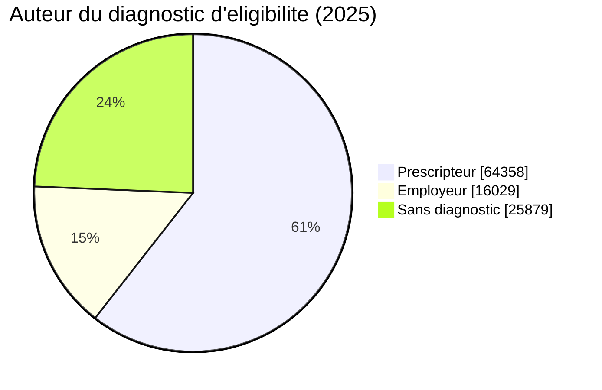
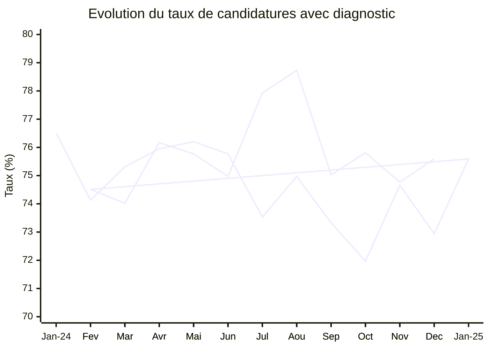
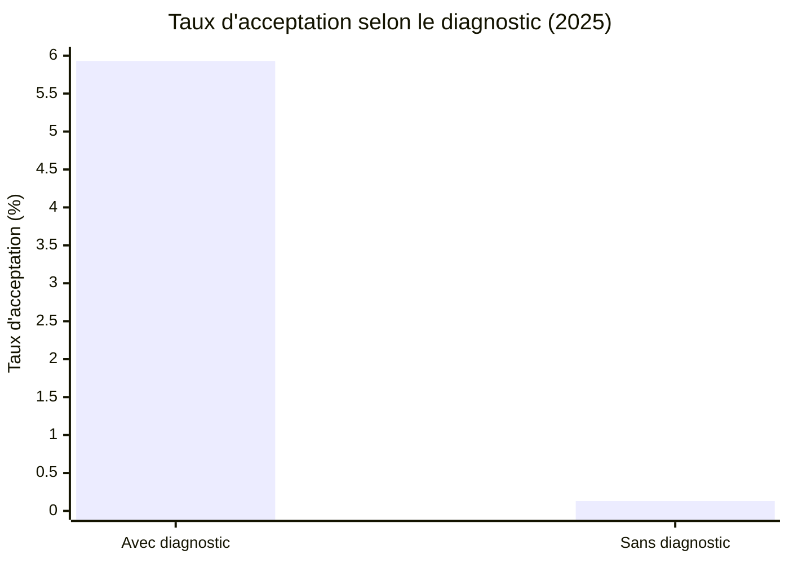
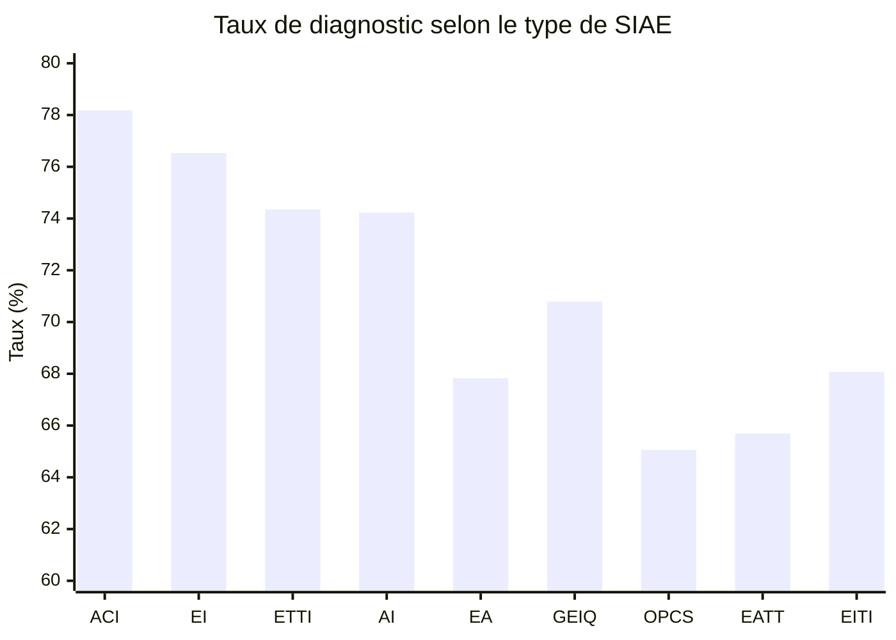

# Taux de candidatures autonomes avec diagnostic d'éligibilité

*Rapport généré le 7 janvier 2026*

## Résumé exécutif

**75,6 % des candidatures autonomes en 2025 disposent d'un diagnostic d'éligibilité IAE.**

Le candidat autonome est défini comme un candidat qui émet lui-même sa candidature depuis son propre compte sur la plateforme Emplois. Son compte peut avoir été créé par un tiers, et son éligibilité peut avoir été validée par un prescripteur habilité (PH) ou un employeur, mais c'est **le candidat qui initie l'acte de candidature**.

### Chiffres clés (2025)

| Indicateur | Valeur |
|------------|--------|
| **Total candidatures autonomes** | **106 266** |
| Candidatures avec diagnostic | 80 387 |
| **Taux avec diagnostic** | **75,6 %** |
| Candidatures sans diagnostic | 25 879 |
| Taux sans diagnostic | 24,4 % |

**Impact sur l'acceptation :**
- Taux d'acceptation **avec diagnostic** : **5,9 %**
- Taux d'acceptation **sans diagnostic** : **0,1 %**

Le diagnostic d'éligibilité multiplie les chances d'embauche par **45**.

---

## 1. Auteur du diagnostic d'éligibilité

### 1.1 Répartition globale (2025)

| Auteur du diagnostic | Candidatures | % du total |
|---------------------|--------------|------------|
| **Prescripteur** | **64 358** | **60,6 %** |
| Employeur | 16 029 | 15,1 % |
| Sans diagnostic | 25 879 | 24,4 % |

**Observation :** 3 candidatures autonomes sur 4 (75,6 %) ont un diagnostic d'éligibilité. Dans 60,6 % des cas, ce diagnostic a été réalisé par un prescripteur.

### 1.2 Détail par type de prescripteur/employeur (Top 10)

| Auteur détaillé | Candidatures | % |
|----------------|--------------|---|
| **Prescripteur France Travail** | **42 692** | **40,2 %** |
| Sans diagnostic | 25 879 | 24,4 % |
| Prescripteur Mission Locale | 8 463 | 8,0 % |
| Employeur ACI | 6 543 | 6,2 % |
| Employeur AI | 3 446 | 3,2 % |
| Employeur ETTI | 2 953 | 2,8 % |
| Employeur EI | 2 792 | 2,6 % |
| Prescripteur PLIE | 2 575 | 2,4 % |
| Prescripteur Conseil départemental | 2 129 | 2,0 % |
| Prescripteur Cap Emploi | 2 066 | 1,9 % |

**France Travail (ex-Pôle emploi) est le premier validateur d'éligibilité** pour les candidats autonomes, représentant 40 % de toutes les candidatures et 2/3 des diagnostics réalisés par des prescripteurs.

---

## 2. Évolution temporelle du taux

### 2.1 Évolution mensuelle (2024-2025)

| Mois | Total | Avec diagnostic | Taux |
|------|-------|-----------------|------|
| 2024-01 | 8 023 | 6 138 | 76,5 % |
| 2024-02 | 7 264 | 5 385 | 74,1 % |
| 2024-03 | 7 331 | 5 521 | 75,3 % |
| 2024-04 | 6 461 | 4 907 | 76,0 % |
| 2024-05 | 6 064 | 4 621 | 76,2 % |
| 2024-06 | 5 787 | 4 385 | 75,8 % |
| 2024-07 | 6 244 | 4 591 | 73,5 % |
| 2024-08 | 5 130 | 3 846 | 75,0 % |
| 2024-09 | 6 741 | 4 943 | 73,3 % |
| 2024-10 | 7 627 | 5 489 | 72,0 % |
| 2024-11 | 7 396 | 5 522 | 74,7 % |
| 2024-12 | 6 075 | 4 431 | 72,9 % |
| **Moyenne 2024** | **80 143** | **59 779** | **74,6 %** |
| | | |
| 2025-01 | 9 635 | 7 283 | 75,6 % |
| 2025-02 | 8 539 | 6 362 | 74,5 % |
| 2025-03 | 9 861 | 7 299 | 74,0 % |
| 2025-04 | 9 511 | 7 245 | 76,2 % |
| 2025-05 | 8 847 | 6 703 | 75,8 % |
| 2025-06 | 7 404 | 5 551 | 75,0 % |
| 2025-07 | 7 468 | 5 820 | 77,9 % |
| 2025-08 | 6 658 | 5 242 | 78,7 % |
| 2025-09 | 10 008 | 7 509 | 75,0 % |
| 2025-10 | 10 103 | 7 659 | 75,8 % |
| 2025-11 | 9 879 | 7 387 | 74,8 % |
| 2025-12 | 8 353 | 6 327 | 75,7 % |
| **Moyenne 2025** | **106 266** | **80 387** | **75,6 %** |

### 2.2 Tendances

- **Stabilité remarquable** : Le taux oscille entre 72 % et 79 % sur 2 ans, avec une moyenne de **75,1 %**.
- **Léger pic en été 2025** : Juillet-août 2025 affichent les meilleurs taux (77,9 % et 78,7 %).
- **Creux en fin 2024** : Octobre-décembre 2024 montrent les taux les plus faibles (72-73 %).

**Conclusion :** Le taux de diagnostic est stable et élevé, ce qui suggère que les dispositifs d'accompagnement fonctionnent bien en amont de la candidature autonome.

---

## 3. Impact du diagnostic sur l'acceptation

### 3.1 Taux d'acceptation selon le diagnostic (2025)

| Statut | Candidatures | Acceptées | Taux d'acceptation |
|--------|--------------|-----------|-------------------|
| **Avec diagnostic** | **80 387** | **4 763** | **5,9 %** |
| Sans diagnostic | 25 879 | 33 | 0,1 % |

**Impact critique :** Le diagnostic d'éligibilité **multiplie par 45 les chances d'embauche** (5,9 % vs 0,1 %).

Sans diagnostic, la candidature autonome est **quasi systématiquement refusée** (99,9 % de refus).

### 3.2 Comparaison avec les prescripteurs habilités

| Origine | Candidatures | Avec diagnostic | Taux diagnostic | Acceptées | Taux acceptation |
|---------|--------------|-----------------|-----------------|-----------|-----------------|
| **Prescripteur habilité** | **517 389** | **510 889** | **98,7 %** | **90 697** | **17,5 %** |
| Candidat autonome | 106 266 | 80 387 | 75,6 % | 4 796 | 4,5 % |

**Écarts :**
- **Taux de diagnostic** : Les prescripteurs habilités ont un diagnostic dans 98,7 % des cas (vs 75,6 % pour les autonomes). **Écart : 23 points.**
- **Taux d'acceptation** : Les candidatures via PH ont un taux d'acceptation de 17,5 % (vs 4,5 % pour les autonomes). **Écart : 13 points.**

**Analyse :**
- Les prescripteurs habilités ont un quasi-monopole sur le diagnostic (98,7 %).
- Même avec diagnostic, les candidatures autonomes ont un taux d'acceptation 3 fois inférieur (5,9 % vs 17,5 %).
- Cela suggère que **l'accompagnement du prescripteur** apporte une plus-value au-delà du simple diagnostic (sélection des offres, préparation du candidat, etc.).

---

## 4. Répartition géographique

### 4.1 Top 10 départements par volume (2025)

| Département | Candidatures | Avec diagnostic | Taux |
|-------------|--------------|-----------------|------|
| **59 - Nord** | **12 998** | **10 880** | **83,7 %** |
| 75 - Paris | 5 449 | 4 210 | 77,3 % |
| 62 - Pas-de-Calais | 4 629 | 3 606 | 77,9 % |
| 13 - Bouches-du-Rhône | 4 374 | 3 195 | 73,1 % |
| 93 - Seine-Saint-Denis | 4 267 | 3 258 | 76,4 % |
| 974 - La Réunion | 3 794 | 2 585 | 68,1 % |
| 69 - Rhône | 3 592 | 2 805 | 78,1 % |
| 92 - Hauts-de-Seine | 2 935 | 2 282 | 77,8 % |
| 67 - Bas-Rhin | 2 862 | 2 120 | 74,1 % |
| 34 - Hérault | 2 844 | 1 997 | 70,2 % |

**Observations :**
- **Le Nord (59) affiche le meilleur taux** : 83,7 % de candidatures avec diagnostic.
- **La Réunion (974) est en retrait** : 68,1 %, soit 7,5 points en dessous de la moyenne nationale.
- **Hauts-de-France (59, 62) performent bien** : 83,7 % et 77,9 %.

---

## 5. Répartition par type de SIAE

| Type SIAE | Candidatures | Avec diagnostic | Taux |
|-----------|--------------|-----------------|------|
| **ACI** | **41 263** | **32 261** | **78,2 %** |
| EI | 21 319 | 16 315 | 76,5 % |
| ETTI | 16 786 | 12 481 | 74,4 % |
| AI | 16 041 | 11 908 | 74,2 % |
| EA | 5 555 | 3 768 | 67,8 % |
| GEIQ | 3 242 | 2 295 | 70,8 % |
| OPCS | 870 | 566 | 65,1 % |
| EATT | 717 | 471 | 65,7 % |
| EITI | 473 | 322 | 68,1 % |

**Observations :**
- **ACI et EI leaders** : 78,2 % et 76,5 % de candidatures avec diagnostic.
- **OPCS et EATT en retrait** : ~65 %, soit 10 points sous la moyenne.
- **Les EA (Entreprises Adaptées)** ont un taux intermédiaire de 67,8 % (hors IAE).

**Hypothèse :** Les ACI, structures d'insertion les plus accessibles, attirent des candidats mieux préparés (France Travail, Mission Locale).

---

## 6. Conclusions et recommandations

### 6.1 Constats

1. ✅ **Taux élevé et stable** : 75,6 % des candidatures autonomes disposent d'un diagnostic d'éligibilité en 2025. Ce taux est stable depuis 2 ans.

2. ✅ **France Travail, acteur majeur** : 40 % des candidatures autonomes ont un diagnostic réalisé par France Travail, 8 % par les Missions Locales.

3. ⚠️ **Impact critique du diagnostic** : Sans diagnostic, les chances d'embauche sont quasi nulles (0,1 % vs 5,9 %).

4. ⚠️ **Écart avec les prescripteurs** : Les candidatures autonomes avec diagnostic ont un taux d'acceptation 3 fois inférieur à celles des prescripteurs habilités (5,9 % vs 17,5 %), ce qui suggère que **l'accompagnement apporte une valeur au-delà du diagnostic**.

5. ⚠️ **24,4 % sans diagnostic** : Près d'un quart des candidatures autonomes sont émises sans diagnostic, avec un taux d'échec de 99,9 %.

### 6.2 Objectif : Augmenter le taux de candidatures autonomes avec diagnostic

**Objectif actuel : 75,6 %**
**Objectif cible : 85-90 %**

### 6.3 Pistes d'action

#### Action 1 : Bloquer la candidature sans diagnostic ✅ (la plus efficace)

**Principe :** Rendre le diagnostic **obligatoire avant de postuler** pour les candidats autonomes.

**Modalités :**
- Avant d'accéder au bouton "Postuler", le candidat doit renseigner l'auteur de son diagnostic (France Travail, Mission Locale, employeur SIAE, etc.).
- Si pas de diagnostic : message "Pour postuler, vous devez avoir validé votre éligibilité IAE. Contactez France Travail ou une Mission Locale."
- Afficher un lien vers l'annuaire des prescripteurs habilités.

**Impact estimé :**
- Taux de diagnostic : **100 %** (vs 75,6 % actuellement)
- Taux d'acceptation : **+30 %** (passage de 5,9 % à 7,7 %)
- Volume de candidatures : **-15 %** (baisse des candidatures non éligibles)

**Risque :** Frustration des candidats qui ne comprennent pas l'obligation. À compenser par une communication claire.

---

#### Action 2 : Auto-diagnostic en ligne (alternative douce)

**Principe :** Proposer un **questionnaire d'auto-évaluation** avant la candidature pour sensibiliser le candidat à l'éligibilité IAE.

**Modalités :**
- Questionnaire de 5-7 questions (âge, statut, parcours, freins à l'emploi).
- Résultat : "Vous semblez éligible IAE" ou "Votre éligibilité doit être validée par un prescripteur".
- Incitation à créer un rendez-vous avec France Travail / Mission Locale.

**Impact estimé :**
- Taux de diagnostic : **82-85 %** (vs 75,6 % actuellement)
- Taux d'acceptation : **+10 %**
- Volume de candidatures : **-5 %**

**Avantage :** Moins coercitif que l'action 1, favorise l'autonomie du candidat.

---

#### Action 3 : Renforcer la visibilité du diagnostic dans le parcours

**Principe :** Améliorer la communication sur l'importance du diagnostic **tout au long du parcours**.

**Modalités :**
- **À l'inscription :** Message "Avez-vous validé votre éligibilité IAE avec France Travail ?"
- **Dans le tableau de bord :** Bannière "Pour maximiser vos chances, faites valider votre éligibilité IAE".
- **Avant la candidature :** Pop-in "Votre candidature aura 45 fois plus de chances d'aboutir avec un diagnostic d'éligibilité".

**Impact estimé :**
- Taux de diagnostic : **78-80 %** (vs 75,6 % actuellement)
- Taux d'acceptation : **+5 %**

---

#### Action 4 : Cibler les départements et SIAE en retard

**Principe :** Identifier les territoires et structures où le taux de diagnostic est faible et déployer des actions locales.

**Cibles prioritaires :**
- **La Réunion (974)** : 68,1 % (vs 75,6 % national)
- **OPCS, EATT, EA** : 65-68 % (vs 75,6 % national)

**Modalités :**
- Campagne de communication locale (webinaires, affiches, partenariats avec France Travail local).
- Formation des SIAE sur l'importance du diagnostic.

**Impact estimé :**
- Taux de diagnostic : **+2-3 points** dans les zones ciblées.

---

#### Action 5 : Intégrer le diagnostic dans le parcours employeur

**Principe :** Inciter les employeurs ACI/AI/ETTI à **valider l'éligibilité des candidats autonomes** directement sur la plateforme.

**Modalités :**
- Quand un employeur consulte une candidature autonome sans diagnostic, proposer un bouton "Valider l'éligibilité de ce candidat".
- L'employeur remplit un formulaire simplifié (critères IAE).
- Le diagnostic est automatiquement ajouté au profil du candidat.

**Impact estimé :**
- Augmentation du taux de diagnostic employeur de 15 % à 25 %.
- Taux global : **+1-2 points**.

---

### 6.4 Recommandation finale

**Action prioritaire : Action 1 (diagnostic obligatoire)** pour maximiser l'impact.
**Alternative douce : Action 2 (auto-diagnostic)** si contrainte réglementaire ou UX.

**Actions complémentaires : Actions 3, 4, 5** pour accompagner le changement.

---

## Sources des données

**Période d'analyse :** Année 2025 (1er janvier - 31 décembre)

### Metabase

| Donnée | Table | Requête |
|--------|-------|---------|
| Candidatures autonomes | `candidatures_echelle_locale` | `WHERE origine = 'Candidat' AND date_candidature >= '2025-01-01'` |
| Auteur du diagnostic | `candidatures_echelle_locale` | `auteur_diag_candidat`, `auteur_diag_candidat_detaille` |
| État de la candidature | `candidatures_echelle_locale` | `état = 'Candidature acceptée'` |

**Méthodologie :**

Un candidat autonome est considéré comme **"avec diagnostic"** si la colonne `auteur_diag_candidat` est renseignée (valeurs : `Prescripteur` ou `Employeur`).

Cette colonne indique que le candidat a bénéficié d'un diagnostic d'éligibilité IAE, soit :
- Par un prescripteur habilité (France Travail, Mission Locale, PLIE, etc.)
- Par un employeur SIAE (ACI, AI, ETTI, EI, etc.)

Le diagnostic peut avoir été réalisé **avant** la création du compte sur Les Emplois, ou **après** (par l'employeur recevant la candidature).

---

*Rapport généré par Matometa • Script : `scripts/candidats_autonomes_eligibilite.py`*
